# Syamsa Design System

Dokumen ini adalah referensi desain resmi untuk pengembangan Syamsa. Dibuat dari reverse engineering aplikasi yang ada di `index.html`, `style.css`, `tailwind.config.js`, `core/app-core.js`, `core/script.js`, `managers/*`, `features/qibla.js`, dan `tahfizh/*`, kemudian diperbaiki, diperbarui, dan dikembangkan menjadi standar yang komprehensif.

---

## 1. Product Overview

**Nama aplikasi:** Syamsa

**Nama lengkap PWA:** Student Activity Attendance and Monitoring System Application

**Tagline:** illuminate every presence

**Tujuan aplikasi:** membantu musyrif/pengelola memantau presensi santri, aktivitas harian, perizinan, pembinaan, laporan, dan progres tahfizh dalam satu aplikasi mobile-first.

**Target pengguna:**

- Musyrif/pengelola kelas/asrama
- Wali santri
- Santri
- Superadmin/testing admin

**Role pengguna:**

| Role | Akses Utama |
|------|------------|
| **Musyrif** | Login kelas, isi presensi, dashboard, izin/sakit/pulang, laporan, profil, timesheet, pembinaan, notifikasi, ekspor |
| **Wali/Santri** | Login dengan NIS/PIN, ringkasan kehadiran, izin, tahfizh, profil, pesan |
| **Tahfizh role** | Santri, musyrif, wali pada modul tahfizh legacy/adapter |
| **Superadmin** | Akses tersembunyi untuk mode admin/testing |

**Masalah yang diselesaikan:**

- Presensi harian santri yang berlangsung pada beberapa sesi
- Kebutuhan melihat siapa hadir, telat, sakit, izin, pulang, atau alpa
- Perizinan yang memengaruhi status presensi otomatis
- Rekap dan analisis kehadiran per santri/kelas
- Monitoring tahfizh, setoran, rekap, analisis, dan progres target
- Pembinaan berdasarkan akumulasi alpa/pelanggaran
- Komunikasi operasional melalui laporan WhatsApp, ekspor, dan notifikasi

**Tujuan bisnis/operasional:**

- Mempercepat input presensi
- Mengurangi presensi terlewat
- Membuat data izin dan presensi konsisten
- Memberi ringkasan cepat untuk keputusan musyrif
- Menyediakan laporan yang mudah dibagikan

---

## 2. Product Principles

- **Mobile first:** viewport dikunci ke pengalaman portrait PWA, bottom navigation, safe area, touch gestures, dan action bar bawah
- **Fast task completion:** presensi bisa dibuka dari kartu sesi, status bisa diganti dengan tap berulang, dan bulk action tersedia
- **Information dense:** layar utama memuat jam, lokasi, jadwal, statistik, sesi, izin aktif, pembinaan, dan shortcut
- **Minimal clicks:** dashboard menyediakan akses cepat ke presensi, izin, laporan, tahfizh, qibla, dan profil
- **Operational efficiency:** status, warna, badge, autosave, notifikasi, dan review gate diarahkan untuk pekerjaan harian musyrif
- **State visibility:** aplikasi menampilkan status tersimpan, belum dipresensi, proses review, aktif/selesai, pending/approved/rejected, online/offline, aman/error GPS
- **Role-aware experience:** musyrif dan wali/santri memiliki permukaan UI berbeda

---

## 3. Information Architecture

```mermaid
flowchart TD
  Loading["Loading / Splash"] --> Login["Login"]
  Login --> Main["Main App: Musyrif"]
  Login --> Wali["Wali/Santri App"]
  Login --> Superadmin["Superadmin / Testing"]

  Main --> Home["Dashboard"]
  Main --> Tahfizh["Tahfizh"]
  Main --> Report["Rekap Presensi"]
  Main --> Profile["Profil Pengelola"]
  Main --> Attendance["Full-screen Presensi"]
  Main --> Qibla["Qibla / Asrama"]

  Home --> SlotCards["Kartu Sesi: Shubuh, Sekolah, Ashar, Maghrib, Isya"]
  Home --> QuickAccess["Quick Access"]
  Home --> PrayerWidget["Jadwal Shalat & Hijri"]
  Home --> Location["GPS / Geofence"]
  Home --> Pembinaan["Pembinaan"]
  Home --> PermitWidgets["Sakit, Izin, Pulang"]

  Attendance --> StudentRows["Daftar Santri"]
  Attendance --> StatusButtons["Status Aktivitas"]
  Attendance --> SearchFilter["Search + Filter Bermasalah"]
  Attendance --> BulkActions["Aksi Massal"]
  Attendance --> SummaryWidget["Ringkasan Presensi"]

  Report --> DailyRecap["Tabel Rekap"]
  Report --> Analysis["Analisis Santri"]
  Report --> Export["CSV / PDF / WA"]

  Profile --> Timesheet["Timesheet Calendar"]
  Profile --> PermitHistory["Riwayat Izin"]
  Profile --> NotificationSettings["Notifikasi"]
  Profile --> BackupRestore["Backup / Restore"]
  Profile --> Settings["Pengaturan"]

  Tahfizh --> TahfizhHome["Beranda"]
  Tahfizh --> TahfizhForm["Input Setoran"]
  Tahfizh --> TahfizhAnalysis["Analisis"]
  Tahfizh --> TahfizhHistory["Riwayat"]
  Tahfizh --> TahfizhRecap["Rekap"]

  Wali --> WaliHome["Home Wali"]
  Wali --> WaliAttendance["Kehadiran"]
  Wali --> WaliPermits["Izin"]
  Wali --> WaliTahfizh["Tahfizh"]
  Wali --> WaliMessages["Pesan"]
  Wali --> WaliProfile["Profil"]

  WaliHome --> WaliSummary["Ringkasan Kehadiran Hari Ini"]
  WaliHome --> WaliSchedule["Jadwal Sesi Aktif"]
  WaliPermits --> WaliPermitHistory["Riwayat Izin"]
  WaliPermits --> WaliPermitForm["Ajukan Izin"]
```



**Navigasi utama Musyrif:**

- Dashboard/Home
- Tahfizh
- Rekap Presensi
- Profil

**Navigasi sekunder:**

- Presensi full-screen dibuka dari sesi, asrama, atau current slot
- Qibla/Asrama dibuka dari widget lokasi/jadwal shalat
- Report memiliki toggle Rekap dan Analisis
- Tahfizh memiliki subnav Beranda, Analisis, Rekap, Form/Input
- Profile memuat timesheet, perizinan, pembinaan, pengaturan, notifikasi

---

## 4. Design Tokens

### 4.1 Color Palette

#### Brand Utama

| Nama | Hex | CSS Variable | Tailwind |
|------|-----|-------------|---------|
| Brand Blue | `#0C81E4` | `--color-brand-blue` | `palette-blue` / `brand-500` |
| Brand Deep | `#0C4E8C` | `--color-brand-deep` | `palette-deep` / `brand-600` |
| Brand Cyan | `#17C3D4` | `--color-brand-cyan` | `palette-cyan` |
| Brand Mint | `#4FE7AF` | `--color-brand-mint` | `palette-mint` |

> **Catatan:** Warna brand diturunkan langsung dari logo Syamsa. Jangan menggunakan hex alternatif untuk brand colors di tempat manapun.

#### Surface — Light Mode

| Nama | Hex / Value | CSS Variable |
|------|------------|-------------|
| Page background | `#F8FAFC` | `--color-surface-page` |
| Card background | `rgba(255,255,255,0.86)` | `--color-surface-card` |
| Card solid | `#FFFFFF` | `--color-surface-card-solid` |
| Input background | `#F1F5F9` | `--color-surface-input` |
| Border soft | `rgba(148,163,184,0.22)` | `--color-border-soft` |
| Border medium | `rgba(148,163,184,0.40)` | `--color-border-medium` |

#### Surface — Dark Mode

| Nama | Hex / Value | CSS Variable |
|------|------------|-------------|
| Page background | `#0F172A` | `--color-surface-page` |
| Card background | `rgba(15,23,42,0.86)` | `--color-surface-card` |
| Card solid | `#1E293B` | `--color-surface-card-solid` |
| Input background | `#1E293B` | `--color-surface-input` |
| Border soft | `rgba(148,163,184,0.18)` | `--color-border-soft` |
| Border medium | `rgba(148,163,184,0.30)` | `--color-border-medium` |

#### Status Warna Resmi

Ini adalah **sumber kebenaran tunggal** untuk warna status. Gunakan `STATUS_META` di seluruh codebase — jangan mendefinisikan ulang secara inline.

| Status | Label | Hex | CSS Variable | Tailwind | Ikon Lucide | Score |
|--------|-------|-----|-------------|---------|------------|-------|
| Hadir | H | `#10B981` | `--color-status-hadir` | `emerald-500` | `Check` | 100 |
| Ya | Y | `#10B981` | `--color-status-ya` | `emerald-500` | `Check` | 100 |
| Telat | T | `#17C3D4` | `--color-status-telat` | `cyan-400` | `ClockAlert` | 80 |
| Sakit | S | `#F59E0B` | `--color-status-sakit` | `amber-500` | `Thermometer` | 75 |
| Izin | I | `#3B82F6` | `--color-status-izin` | `blue-500` | `FileText` | 75 |
| Pulang | P | `#A855F7` | `--color-status-pulang` | `purple-500` | `Home` | 0 |
| Alpa | A | `#EF4444` | `--color-status-alpa` | `red-500` | `AlertTriangle` | -50 |
| Tidak | - | `#64748B` | `--color-status-tidak` | `slate-500` | `Minus` | 0 |

> **Telat:** standar warna adalah `#17C3D4` (brand cyan). Inkonsistensi teal `#14b8a6` dan amber `#f59e0b` sudah distandardisasi ke cyan.

#### Feature Domain Colors

| Fitur | Warna Utama | Hex | Penggunaan |
|-------|------------|-----|-----------|
| Dashboard/Home | Emerald | `#10B981` | Active nav, hero slot, status hadir |
| Tahfizh | Orange | `#F97316` | Header, card, badge, CTA tahfizh |
| Laporan/Rekap | Blue | `#3B82F6` | Nav active, tabel, export |
| Profil | Purple | `#A855F7` | Nav active, timesheet, profile header |
| Qibla | Green | `#25D654` | Finder circle, direction arrow |
| Perizinan – Sakit | Amber | `#F59E0B` | Badge, card border |
| Perizinan – Izin | Blue | `#3B82F6` | Badge, card border |
| Perizinan – Pulang | Purple | `#A855F7` | Badge, card border |

### 4.2 Gradient System

Gradient **hanya boleh** digunakan untuk konteks yang didefinisikan di sini. Jangan membuat gradient baru di card biasa atau komponen umum.

| Nama | Value | Digunakan Pada |
|------|-------|---------------|
| `gradient-brand` | `linear-gradient(135deg, #0C81E4 0%, #17C3D4 100%)` | Hero utama, CTA brand |
| `gradient-nav-home` | `linear-gradient(135deg, #10B981 0%, #059669 100%)` | Bottom nav Home active |
| `gradient-nav-tahfizh` | `linear-gradient(135deg, #F97316 0%, #EA580C 100%)` | Bottom nav Tahfizh active |
| `gradient-nav-report` | `linear-gradient(135deg, #3B82F6 0%, #2563EB 100%)` | Bottom nav Report active |
| `gradient-nav-profile` | `linear-gradient(135deg, #A855F7 0%, #9333EA 100%)` | Bottom nav Profile active |
| `gradient-tahfizh-hero` | `linear-gradient(160deg, #7C2D12 0%, #F97316 60%, #FCD34D 100%)` | Tahfizh hero card |
| `gradient-attendance-header` | `linear-gradient(180deg, rgba(15,23,42,0.95) 0%, rgba(15,23,42,0.80) 100%)` | Header presensi full-screen |

### 4.3 Typography

**Font utama:** Plus Jakarta Sans — semua teks umum

**Font sekunder:** Rubik — aksen greeting header, judul welcome

**Font mono:** DM Mono — data numerik, label metadata, timestamp

**Import Google Fonts:**

```css
@import url('https://fonts.googleapis.com/css2?family=Plus+Jakarta+Sans:wght@400;500;600;700;800;900&family=Rubik:wght@400;500;600;700&family=DM+Mono:wght@400;500&display=swap');
```

**Font scale:**

| Nama | Size | Weight | Penggunaan |
|------|------|--------|-----------|
| Micro | `8px` – `9px` | 600–700 | Label status sangat kecil |
| Label XS | `10px` | 600 | Header kolom tabel uppercase |
| Caption | `11px` – `12px` | 400–500 | Metadata, timestamp, catatan |
| Body compact | `13px` – `14px` | 400–500 | Teks baris santri, daftar |
| Body | `15px` – `16px` | 400–500 | Teks standar |
| Section title | `16px` – `18px` | 600–700 | Judul section, card title |
| Hero | `20px` – `24px` | 700–800 | Dashboard hero, halaman title |
| Display | `32px`+ | 800–900 | Greeting, splash |
| Qibla angle | `42px` – `72px` (responsive) | 900 | Sudut kompas qibla |

**Rules:**

- Gunakan `tabular-nums` untuk semua angka counter, jam, dan statistik
- Gunakan `truncate` atau `line-clamp-1` untuk nama panjang
- Marquee hanya untuk nama lokasi/asrama yang operasional, bukan teks umum
- Weight pattern: `font-black`/`font-extrabold` untuk angka kunci, `font-bold` untuk heading/CTA, `font-semibold` untuk label sekunder

### 4.4 Radius

| Nama | Value | CSS Variable | Digunakan Pada |
|------|-------|-------------|---------------|
| Chip | `0.5rem` (8px) | `--radius-chip` | Badge kecil, tag status |
| Control | `0.875rem` (14px) | `--radius-control` | Input, button, select, card kecil |
| Panel | `1.5rem` (24px) | `--radius-panel` | Modal, bottom sheet, card besar |
| Full | `999px` | `--radius-full` | Pill button, avatar, status dot |

> **Standar baru:** gunakan `1.5rem` untuk cards/modal besar, `0.875rem` untuk inputs/buttons, `999px` untuk pill/avatar. Jangan mix `2rem`, `2.5rem`, `rounded-3xl` tanpa alasan struktur yang jelas.

### 4.5 Shadow / Elevation

| Level | CSS Value | Digunakan Pada |
|-------|-----------|---------------|
| Elevation 0 | `none` | Flat item, table row |
| Elevation 1 | `0 2px 8px -2px rgba(15,23,42,0.08)` | Card resting |
| Elevation 2 | `0 14px 40px -24px rgba(15,23,42,0.28)` | Card default |
| Elevation 3 | `0 18px 46px -26px rgba(12,78,140,0.32)` | Card hover / focused |
| Elevation 4 | `0 24px 70px -32px rgba(15,23,42,0.45)` | Modal, bottom sheet |
| Floating | `0 10px 35px rgba(0,0,0,0.12)` | Bottom controls, FAB |

### 4.6 Spacing

| Nama | Value | Penggunaan |
|------|-------|-----------|
| Micro | `0.25rem` – `0.5rem` | Gap antar icon dan label kecil |
| Compact | `0.75rem` – `1rem` | Padding card compact, gap list item |
| Standard | `1rem` – `1.25rem` | Padding card standar |
| Relaxed | `1.5rem` – `2rem` | Hero padding, section gap |
| Safe area bottom | `env(safe-area-inset-bottom)` | Bottom nav, attendance bar |
| Safe area top | `env(safe-area-inset-top)` | Status bar header |

### 4.7 Z-index Layers

| Layer | Value | Komponen |
|-------|-------|---------|
| Content | `0` – `10` | Card, row, content area |
| Sticky | `20` – `30` | Sticky header, sticky hero |
| Attendance bar | `z-40` | Bottom control bar presensi |
| Bottom nav | `z-50` | Navigasi utama |
| Summary widget | `z-50` | Attendance summary floating |
| Overlay | `z-[60]` | Modal backdrop |
| Modal | `z-[100]` | Modal panel (via `openModal`) |
| Modal stacked | `z-[110]`+ | Modal di atas modal (stack +10) |
| Toast | `z-[9999]` | Toast notification |

> **Standar baru:** semua modal wajib menggunakan `openModal/closeModal` stack. Nilai `z-[999]` dan `z-[1000]` manual harus dimigrasikan ke modal stack.

---

## 5. Layout System

### 5.1 App Shell

- Full viewport height: `100dvh` (dynamic viewport height untuk mobile browser)
- Body: `overflow: hidden` — setiap view mengelola scrolling internalnya sendiri
- Theme: `html.dark` untuk dark mode toggle
- Font: `font-family: 'Plus Jakarta Sans', sans-serif` pada `body`

### 5.2 Breakpoints

| Nama | Min Width | Keterangan |
|------|-----------|-----------|
| Mobile S | `320px` | iPhone SE, smallest |
| Mobile | `375px` | **Default mobile target** |
| Mobile L | `430px` | Large phone |
| Tablet | `768px` | iPad mini |
| Desktop | `1024px` | **Breakpoint responsif utama** |
| Wide | `1280px` | Desktop lebar |
| Max content | `1536px` | Batas `max-w-7xl` |

### 5.3 Safe Area (iOS PWA)

```css
/* Bottom nav dan attendance bar harus selalu pakai ini */
padding-bottom: env(safe-area-inset-bottom);

/* Header bila status bar tidak ditangani native */
padding-top: env(safe-area-inset-top);
```

### 5.4 Scroll Behavior

```css
/* Setiap view container */
overflow-y: auto;
-webkit-overflow-scrolling: touch;
overscroll-behavior: contain;

/* Sembunyikan scrollbar — tampilkan hanya saat scrolling */
scrollbar-width: none;
-ms-overflow-style: none;
}
.scroll-container::-webkit-scrollbar {
  display: none;
}
```

### 5.5 Content Width

| Konteks | Max Width |
|---------|----------|
| Konten utama | `max-w-7xl` |
| Form terfokus | `max-w-sm` – `max-w-md` |
| Panel modal | `max-w-xl` |
| Full screen (presensi, qibla) | `100%` / `100vw` |

### 5.6 Grid Patterns

| Fitur | Grid |
|-------|------|
| Dashboard stats | `grid-cols-2 md:grid-cols-4` |
| Slot cards | `grid-cols-2` dengan wide variant `col-span-2` |
| Profile | `lg:grid-cols-12` |
| Status mini counters | `grid-cols-3`, `grid-cols-4`, atau `grid-cols-6` sesuai konteks |
| Wali summary | `grid-cols-2` |

### 5.7 Header

- Menggabungkan: avatar, greeting, prayer countdown, jam, notifikasi, tombol pesan
- Sticky dan compact saat scroll
- Tidak memuat marketing copy
- Height standar: `56px`–`64px` saat collapsed

### 5.8 Navigation

**Mobile (Bottom Nav):**

- 4 item: Home, Tahfizh, Rekap, Profil — maksimum, tidak boleh lebih
- Default state: scaled `0.75`, icon saja tanpa label
- Active state: flex-grow, label muncul, gradient background sesuai domain
- Transisi: `220ms ease-out`
- Selalu respek `env(safe-area-inset-bottom)`

**Desktop (Sidebar Nav):**

- Sinkron dengan mobile bottom nav (4 item yang sama)
- Label selalu terlihat
- Submenu sebagai nested list atau tab internal

---

## 6. Component Library

### 6.1 Button

**Anatomy:** `[icon?] [label] [trailing-icon?]`

**Variants:**

| Variant | Background | Text | Penggunaan |
|---------|-----------|------|-----------|
| `primary-brand` | `#0C81E4` | white | Login, auth, CTA global |
| `primary-attendance` | `#10B981` | white | Mulai presensi, simpan |
| `primary-tahfizh` | `#F97316` | white | CTA di modul tahfizh |
| `danger` | `#EF4444` | white | Hapus, tolak, destructive |
| `secondary` | white/`slate-800` | foreground | Aksi sekunder, bordered |
| `ghost` | transparent | foreground | Aksi tersier, nav tambahan |
| `icon` | varies | — | Square `32px`–`48px` |
| `pill` | varies | varies | Compact nav/actions, filter chip |

**Sizes:**

| Size | Height | Padding H | Font |
|------|--------|-----------|------|
| `sm` | `32px` | `1rem` | `12px` |
| `md` | `40px` | `1.25rem` | `14px` |
| `lg` | `48px` | `1.5rem` | `16px` |

**States:**

- Hover: `brightness-110`, `translateY(-1px)`
- Active: `scale(0.96)`
- Disabled: `opacity-55`, `cursor-not-allowed`
- Loading: spinner kiri + label "Memuat..."
- Focus visible: `outline: 2px solid var(--color-brand-blue); outline-offset: 2px`

**Do:** gunakan warna sesuai domain fitur/status.

**Don't:** jangan gradient dekoratif kecuali sudah ada pola di nav/hero/feature. Jangan warna acak untuk CTA utama.

---

### 6.2 Card / Panel

**Anatomy:** `[header?] [body] [footer?]`

**Variants:**

| Variant | Style | Penggunaan |
|---------|-------|-----------|
| `glass` | `backdrop-blur-md`, translucent bg, soft border | Di atas background berwarna/bergambar |
| `solid` | `bg-white dark:bg-slate-800`, elevation-2 | Kartu data standar |
| `interactive` | solid + hover lift + cursor-pointer | Kartu yang bisa diklik |
| `slot` | icon + badge + progress | Kartu sesi presensi |
| `tahfizh` | glass putih/dark + aksen orange | Kartu modul tahfizh |
| `alert` | border berwarna status + bg tint | Isu/warning/info penting |
| `stat` | angka besar + label kecil + trend | Statistik ringkas |

**States:** normal, hover (elevation-3), active/current (ring brand), inactive/disabled (opacity-60), sticky hero compact.

**Do:** card untuk item berulang, statistik operasional, dan panel form.

**Don't:** nested card lebih dari satu tingkat. Jangan menambah card dashboard tanpa keputusan operasional yang jelas.

---

### 6.3 Badge / Pill

**Anatomy:** `[icon?] [label]`

**Variants:**

| Tipe | Contoh |
|------|--------|
| Status presensi | H, T, S, I, P, A, Y, `-` |
| Permit category | Sakit, Izin Kegiatan, Izin Pulang |
| Permit status | Pending, Approved, Rejected, Aktif, Selesai |
| Date/context | Hari ini, Kemarin, Lampau |
| Network state | Online, Offline |

**Size:**

- Compact: `px-1.5 py-0.5 text-[10px] font-bold rounded`
- Standard: `px-2 py-1 text-xs font-semibold rounded-md`
- Pill: `px-3 py-1 text-xs font-semibold rounded-full`

**Do:** badge singkat dan berwarna konsisten dengan domain status/kategorinya.

**Don't:** jangan pakai satu warna untuk dua makna status berbeda pada layar yang sama.

---

### 6.4 Form / Input

**Anatomy:** `[label] [input] [helper-text / error-message]`

**States:**

| State | Border | Background | Icon |
|-------|--------|-----------|------|
| Empty | `--color-border-soft` | `--color-surface-input` | — |
| Focused | `#0C81E4` + ring 2px 25% opacity | white | — |
| Valid | `#10B981` | white | `CheckCircle` trailing |
| Invalid | `#EF4444` | white | `AlertCircle` trailing |
| Disabled | soft border | `slate-100/slate-700`, opacity-50 | — |
| Loading | `#0C81E4` | white | `Loader` spinning trailing |

**Error message:**

```
[Label]
[Input field — border merah]
[⚠ Teks error — text-red-500 text-xs mt-1]
```

Pesan error harus spesifik: "Nama santri harus diisi", bukan "Field ini wajib diisi".

**Input types:**

- Text, password, number, tel
- Textarea (note/alasan izin)
- Select/combobox (kelas, sesi, santri)
- Date/time picker
- Checkbox, radio, toggle switch
- File upload (lampiran izin)
- OTP/PIN input (login wali/santri)

**Multi-step form pattern (permit form):**

1. Step indicator di atas (dots atau progress bar)
2. Validasi per step sebelum lanjut — tombol Lanjut disabled bila invalid
3. Tombol Kembali tersedia di setiap step
4. Review step sebelum submit final
5. Loading state saat submit
6. Success state dengan ringkasan data tersimpan

---

### 6.5 Modal / Bottom Sheet

**Anatomy:** `[backdrop] [panel: [header: title + close] [body] [footer?]]`

**Daftar modal yang ada:**

- Rekap bulanan
- Activity log
- Confirm dialog (destructive)
- Permit input/edit
- Google auth
- Musyrif login, wali login
- Bulk attendance actions
- Stat detail, bento sesi detail
- Input pembinaan
- Image zoom (lampiran izin) — self-contained

**Rules:**

- Selalu gunakan `openModal/closeModal` untuk stack management, escape key, dan `aria-modal`
- Mobile: bottom sheet (`bottom-0`, `rounded-t-[1.5rem]`)
- Desktop: center modal (`max-w-xl mx-auto`)
- Backdrop: `rgba(0,0,0,0.5)` + `backdrop-blur-sm`
- `role="dialog"` dan `aria-modal="true"` wajib di semua modal
- Confirm destructive: gunakan `showConfirmModal`, bukan `window.confirm`
- Image zoom boleh manual toggle karena self-contained dan temporer

**Z-index:** stack mulai `z-[100]`, naik `+10` untuk setiap modal di atas modal.

---

### 6.6 Progress Bar

**Variants:**

| Variant | Penggunaan |
|---------|-----------|
| Linear | Progress sesi presensi, loading data |
| Segmented | Distribusi status H/T/S/I/P/A dalam satu bar |
| Circular/Ring | Tahfizh target progress |
| Conic | Dashboard summary donut |

**Rules:**

- Linear: height `6px`–`8px`, `border-radius: 999px`
- Animasi fill: `300ms`–`500ms ease-out`
- Tahfizh ring: `1000ms` first render
- Selalu tampilkan nilai persentase di dekat visual

---

### 6.7 Skeleton Loader

Gunakan skeleton untuk konten dengan struktur yang sudah diketahui. Jangan spinner untuk ini.

**Pattern:** animated shimmer gradient — `slate-200` ke `slate-100` (light), `slate-700` ke `slate-600` (dark), durasi `1500ms infinite`, radius sesuai komponen.

**Kapan pakai skeleton vs spinner:**

| Situasi | Komponen |
|---------|---------|
| List santri loading | Skeleton rows |
| Dashboard stats loading | Skeleton stat cards |
| Data tidak diketahui strukturnya | Spinner `16px`–`20px` inline |
| App bootstrap | Full-screen splash |
| Qibla compass init | Spinner besar |

---

### 6.8 Search

**Variants:**

| Variant | Konteks |
|---------|---------|
| Morphing pill (bottom bar) | Presensi — muncul dari ikon search |
| Inline search bar | Permit checklist, riwayat izin |
| Filter + search combo | Permit tab, tahfizh riwayat |

**Rules:**

- Realtime filter, debounce `150ms`–`300ms`
- Placeholder spesifik: "Cari nama santri...", "Cari berdasarkan alasan..."
- Hasil kosong harus menampilkan empty state dengan query aktif

---

### 6.9 Filter

**Variants:**

- Toggle bermasalah di presensi
- Segmented type/status pada permits
- Report mode: Harian / Mingguan / Bulanan / Semester / Tahunan
- Analysis mode: Harian / Mingguan / Bulanan / Semester
- Tahfizh target/rekap tabs

**Rules:**

- Filter aktif harus visually obvious: background, border, atau count badge
- Tampilkan total terfilter: "Menampilkan 3 dari 24 santri"

---

### 6.10 Table

**Anatomy:** `[toolbar: search + filter + export] [table: thead + tbody] [footer: total/count]`

**Rules:**

- Header: uppercase, `10px`, `font-semibold`, `tracking-wider`, `muted-foreground`
- Row hover: `bg-slate-50 dark:bg-slate-800/50`
- Badge dalam tabel: compact size
- Horizontal overflow mobile: `overflow-x-auto`
- Min column width: `min-w-[120px]` nama, `min-w-[60px]` status

---

### 6.11 Attendance Item / Student Row

**Anatomy:** `[avatar-status] [nama + kelas/asrama] [permit-badge?] [note-icon?] [status-buttons] [note-input?]`

**States:**

| State | Visual |
|-------|--------|
| Normal/Hadir | Avatar hijau, tidak ada badge issue |
| Bermasalah | Avatar warna status, badge di nama |
| Ada permit aktif | Badge permit category |
| Ada catatan | Ikon note solid (vs outline tanpa catatan) |

**Rules:**

- Avatar/icon mencerminkan status dominan dengan warna status resmi
- Issue status tidak boleh tersembunyi di belakang interaksi tambahan
- Touch target status button: minimal `44px × 44px`
- Tap cycle resmi: lihat Section 7.2

---

### 6.12 Swipe Action Row (Mobile)

- Swipe kiri: reveal aksi "Tandai Bermasalah" (merah)
- Swipe kanan: reveal aksi "Hadir" (emerald)
- Threshold swipe: `60px` reveal, `120px` auto-trigger
- Semua aksi swipe tetap tersedia via tap biasa — swipe hanya shortcut

---

### 6.13 Toast

**Anatomy:** `[icon] [title] [description?] [action?] [close]`

**Variants:**

| Variant | Warna | Ikon |
|---------|-------|------|
| Success | `#10B981` | `CheckCircle` |
| Info | `#3B82F6` | `Info` |
| Warning | `#F59E0B` | `AlertCircle` |
| Error | `#EF4444` | `XCircle` |

**Rules:**

- Posisi: kanan atas desktop, bawah tengah mobile
- Satu implementasi — tidak boleh duplikat di `tab-manager.js` dan `core/script.js`
- Persistent (tanpa auto-dismiss) hanya untuk error yang butuh tindakan
- Deduplicate: jangan tampilkan toast identik secara bersamaan
- Max stack: 3 toast sekaligus

---

### 6.14 Tabs / Segmented Controls

**Variants:**

| Variant | Tampilan | Penggunaan |
|---------|---------|-----------|
| Underline tab | Active: border-bottom, warna domain | Report vs Analysis |
| Pill segmented | Active: filled background | Permit Sakit/Izin/Pulang |
| Subnav | Full-width pill, rounded | Tahfizh sub-pages |
| Bottom nav | Icon + label, gradient active | Navigasi utama |

**Rules:** active tab memakai warna domain fitur sesuai Feature Domain Colors (Section 4.1).

---

### 6.15 Date Picker / Calendar

**Variants:**

| Variant | Penggunaan |
|---------|-----------|
| Single date | Tanggal mulai permit, tanggal laporan |
| Date range | Rentang izin/pulang |
| Month picker | Rekap bulanan, timesheet |
| Calendar grid | Timesheet, kalender status harian |

**Rules:**

- Calendar grid: 7 kolom, dot/status per hari
- Hari libur: marking khusus (tanda bintang atau warna berbeda)
- Navigasi: chevron kiri/kanan antar bulan
- Hari ini: ring brand-blue

---

### 6.16 File Upload

**Konteks:** lampiran izin/sakit

**Pattern:**

1. Area drag-and-drop atau tombol "Pilih File"
2. Preview thumbnail setelah upload
3. Nama file + ukuran file
4. Tombol hapus
5. Progress bar upload
6. Zoom overlay untuk preview fullscreen

**Rules:**

- Tipe diterima: `image/*`, `application/pdf`
- Max size: tampilkan di helper text, mis. "Maks 5MB"
- Error upload: toast error + reset field

---

### 6.17 Empty State

**Anatomy:** `[icon 40px–48px] [title] [description] [action?]`

**Rules:**

- Icon: `40px`–`48px`, `strokeWidth={1.5}`, warna `muted-foreground`
- Border: dashed soft
- Text: `10px`–`12px`, centered
- Tanpa ilustrasi besar atau marketing copy

**Contoh copy:**

| Konteks | Title | Description |
|---------|-------|-------------|
| Semua hadir | "Semua santri lengkap" | "Tidak ada santri bermasalah hari ini." |
| Tidak ada izin | "Belum ada izin" | "Izin yang diajukan akan muncul di sini." |
| Tahfizh kosong | "Belum ada setoran" | "Tambahkan setoran pertama untuk santri ini." |
| Search tidak ditemukan | "Tidak ditemukan" | "Tidak ada hasil untuk \"[query]\"." |

---

## 7. Attendance Design Rules

Status presensi adalah sumber kebenaran tunggal yang melintas dashboard, list, laporan, analisis, ekspor, dan tampilan wali.

### 7.1 Tabel Status Resmi

Lihat Section 4.1 — Status Warna Resmi untuk tabel lengkap dengan hex, CSS variable, Tailwind, dan ikon.

### 7.2 Tap Cycle Resmi

```
Hadir (H) → Alpa (A) → Sakit (S) → Izin (I) → Pulang (P) → Telat (T) → Hadir (H)
```

Siklus ini mengikuti urutan di `core/script.js`. Jangan mengubah urutan tanpa memperbarui konstanta status.

### 7.3 Prioritas Tampilan Issue

Urutan prioritas dari tertinggi ke terendah (mengikuti `core/script.js`):

```
Pulang > Sakit > Alpa > Izin > Telat > Hadir > Ya > Tidak
```

### 7.4 Sesi Presensi

| Sesi | Waktu | Aktivitas |
|------|-------|-----------|
| Shubuh | 04:00–06:00 | Fardu, sunnah, tahfizh/conversation |
| Sekolah | 06:00–15:00 | KBM sekolah |
| Ashar | 15:00–17:00 | Fardu, dzikir |
| Maghrib | 18:00–19:00 | Fardu, sunnah, KBM mahad, puasa/Ramadhan |
| Isya | 19:00–21:00 | Fardu, sunnah, Al-Kahfi/Tarawih |

### 7.5 Sesi States

| State | Tampilan | Aksi Tersedia |
|-------|---------|--------------|
| Active | Normal, dapat diisi | Input presensi, bulk action |
| Locked | Gembok icon + teks "Terkunci" | Hanya view |
| Waiting | Jam icon + countdown | Tampilkan waktu mulai saja |
| Holiday | Kalender icon + label hari libur | Tidak ada |
| Requires Review | Badge "Perlu Review" oranye | Review + confirm |
| Confirmed | Badge "Selesai" hijau | Export, view saja |

### 7.6 Aturan Perhitungan

- **Persentase hadir:** `(Hadir + Ya + Telat) / total aktivitas × 100`
- **Report score:** menggunakan nilai di `STATUS_SCORE` per status
- Pulang = score 0, Alpa = score -50
- Sakit dan Izin = score 75
- Slot harus final/review confirmed sebelum masuk laporan final
- Jika `__requiresReview = true` dan belum confirmed → status laporan = "Proses"

### 7.7 Permit Memengaruhi Presensi

- **Sakit aktif:** ubah status menjadi Sakit dari tanggal/sesi mulai sampai tanggal/sesi selesai
- **Izin/Pulang aktif:** ubah status menjadi Izin/Pulang sampai deadline
- **Melewati deadline:** evaluasi otomatis menjadi Alpa jika santri belum kembali

---

## 8. Data Visualization Rules

### 8.1 Library Standard

| Library | Konteks |
|---------|---------|
| Chart.js | Aplikasi existing (web + PWA) |
| Recharts | Web makeover / React components |
| CSS conic-gradient | Dashboard summary donut sederhana |
| CSS progress bar | Linear progress sesi |

### 8.2 Pola Chart per Fitur

| Fitur | Chart Type | Data | Notes |
|-------|-----------|------|-------|
| Dashboard summary | Donut / Conic | H/T/S/I/P/A percentage | Compact, tanpa label panjang |
| Laporan harian | Bar chart | Status per santri | Color = status color resmi |
| Analisis trend | Line chart | % hadir per periode | Multi-line untuk top issues |
| Tahfizh progress | Circular ring | Juz selesai / target | Orange domain |
| Tahfizh peta juz | Heatmap grid | Juz 1–30 status | Warna berdasarkan intensitas |
| Timesheet | Calendar dot | Hadir/absen per hari | Dot warna per status |
| Analisis santri | Bar horizontal | Ranking kehadiran | Truncate nama panjang |

### 8.3 Rules Visualisasi

**Boleh digunakan ketika:**

- Data membantu keputusan musyrif hari ini
- Ada denominator yang jelas (total santri, total sesi, target juz)
- Status dan periode terlihat jelas
- Visual ringkas dan bisa dipindai di mobile

**Tidak boleh digunakan ketika:**

- Angka tidak bisa ditindaklanjuti
- Hanya dekorasi dashboard
- Periode atau basis perhitungan tidak jelas
- Membuat layar presensi lebih lambat

---

## 9. UX Patterns

### 9.1 Search

- Realtime dengan debounce `150ms`–`300ms`
- Placeholder spesifik per konteks
- Empty state saat query tidak menemukan hasil

### 9.2 Filter

- Segmented controls atau select
- Filter aktif memiliki count badge atau background aktif
- Tampilkan total item terfilter

### 9.3 Sorting

- Sortable column header dengan ikon `ChevronUp`/`ChevronDown`
- Default sort: nama ascending untuk daftar santri

### 9.4 Pagination

- Belum ada pola baku — gunakan scroll internal + filter/search terlebih dahulu
- Jika diperlukan: simple prev/next dengan page number

### 9.5 Pull to Refresh

- Tarik ke bawah untuk refresh dashboard/list
- Spinner muncul di atas list saat threshold `60px` tercapai
- Haptic feedback bila tersedia (`navigator.vibrate(10)`)

### 9.6 Swipe Gesture

- Swipe kiri pada baris santri: reveal aksi bermasalah
- Swipe kanan: tandai hadir
- Semua aksi swipe tetap tersedia via tap biasa

### 9.7 Loading State

| Situasi | Pattern |
|---------|---------|
| App bootstrap | Splash screen full |
| List data | Skeleton rows |
| Widget kecil | Spinner `16px` inline |
| Qibla compass | Spinner besar + teks status |
| Async GPS | Pulse indicator |

### 9.8 Error State

- Toast error + pesan inline di dekat elemen yang gagal
- Pesan harus menyebut tindakan selanjutnya bila memungkinkan
- Tombol retry bila relevan

### 9.9 Confirmation Dialog

```
[Judul: "Hapus data ini?"]
[Deskripsi: "Tindakan ini tidak dapat dibatalkan."]
[Tombol Batal — secondary] [Tombol Hapus — danger]
```

Selalu gunakan `showConfirmModal`. Jangan `window.confirm`.

### 9.10 Success Feedback

- Toast success emerald + update visual state langsung
- Jangan hanya mengubah data tanpa feedback visual ke pengguna

### 9.11 Empty State

- Icon + title + description singkat, tanpa ilustrasi besar
- Lihat Section 6.17 untuk detail dan contoh copy

---

## 10. Mobile UX Rules

- Touch target minimal `44px × 44px` untuk semua aksi utama
- Bottom action bar untuk pekerjaan cepat: search presensi, bulk action, bottom nav
- **Thumb zone:** aksi presensi, search, dan bulk action di area bawah layar
- Header compact saat scroll; sticky hero collapse menjadi satu baris
- Text truncate/marquee hanya untuk nama/lokasi panjang yang operasional
- Jangan menaruh aksi penting hanya di pojok kiri atas layar presensi
- Bottom nav selalu menghormati `env(safe-area-inset-bottom)`
- Input presensi harus bisa dioperasikan dengan ibu jari satu tangan

---

## 11. Accessibility

- Focus visible: `outline: 2px solid #0C81E4; outline-offset: 2px` — pertahankan di semua interactive element
- Modal: `role="dialog"` dan `aria-modal="true"` via `openModal`
- Status badge: `aria-label` (contoh: `aria-label="Status: Hadir"`)
- Jangan mengandalkan warna saja — gunakan label H/T/S/I/P/A dan icon bersamaan
- Touch target minimal `44px` untuk kontrol sering dipakai
- Body text minimal `12px`–`14px`; micro text `8px`–`10px` hanya untuk metadata
- Kontras WCAG AA: 4.5:1 untuk teks kecil, 3:1 untuk teks besar/interactive element
- Tombol icon harus punya `aria-label` yang deskriptif

---

## 12. Anti Design Slop Rules

**Dilarang:**

- Menambah card dashboard tanpa aksi atau keputusan operasional yang jelas
- Membuat hero section generik/marketing copy di dalam aplikasi operasional
- Menggunakan statistik palsu atau insight tanpa sumber data nyata
- Menambah empty space besar di layar presensi, laporan, atau dashboard operasional
- Nested card lebih dari satu tingkat
- Glassmorphism berlebihan di konten data padat
- Gradient di card biasa — gradient hanya untuk nav active, hero utama, tahfizh hero, dan CTA yang sudah didefinisikan
- Animasi dekoratif yang mengganggu input presensi
- Mengganti warna status tanpa memperbarui dokumen ini dan konstanta `STATUS_META`
- Lorem ipsum atau data palsu di production/staging
- Ikon dekoratif tanpa makna operasional

---

## 13. Feature Design Standards

### Dashboard

- **Fungsi:** pusat status hari ini
- **Pola:** header compact, lokasi/GPS, hero current slot, quick access, jadwal sesi, jadwal shalat, statistik, izin aktif, pembinaan
- **Aksi utama:** mulai/ubah presensi, buka izin, laporan, tahfizh, qibla
- **Hindari:** chart besar tanpa tindakan, marketing copy, angka tanpa konteks

### Presensi

- **Fungsi:** input tercepat
- **Pola:** full-screen, header gelap, status autosave, GPS, summary floating, bottom search, bulk action
- **Student row:** compact — nama, status, permit badge, note icon
- **Tap cycle:** `Hadir → Alpa → Sakit → Izin → Pulang → Telat → Hadir`
- **Sesi states:** locked / waiting / holiday / requires-review / confirmed

### Timesheet

- **Fungsi:** kalender aktivitas/presensi pengelola
- **Pola:** profile tab, month picker di label, streak indicators, calendar grid 7 kolom
- **Penting:** jangan campur dengan laporan santri — ini area profil pengelola

### Laporan

- **Fungsi:** rekap kelas/santri per periode
- **Pola:** mode periode, table dense, badge status, grade/predikat, trend, export
- **Mobile:** horizontal-scroll table
- **Export:** ikuti warna status resmi dari `STATUS_META`

### Pengaturan

- Tersebar di Profile: dark mode, notifikasi, backup/restore, logout, Google auth
- Tidak perlu halaman top-level baru sampai jumlah kontrol melebihi `12–15 item`

### Notifikasi

- **Fungsi:** reminder presensi, sesi mulai, hampir terkunci, izin belum diverifikasi, sakit/izin/pulang aktif
- **Pola:** permission button, toast result, badge indicator di nav
- Harus menghormati `appState.settings.notifications`

### Tahfizh

- **Fungsi:** input setoran, analisis, riwayat, rekap target
- **Warna domain:** orange `#F97316` — semua permukaan utama tahfizh
- **Subnav:** Beranda, Analisis, Rekap, Form/Input
- **Jangan:** pakai emerald sebagai warna utama tahfizh; standar baru adalah orange

### Perizinan

- **Fungsi:** sakit, izin kegiatan, pulang/liburan, approval, lampiran, audit trail
- **Warna per kategori:** sakit = amber, izin = blue, pulang = purple
- **Permit active card:** tampilkan kategori, santri, alasan, rentang tanggal, aksi lanjutan

### Qibla / Asrama

- **Fungsi:** kompas kiblat dan konteks lokasi/asrama
- **Pola visual berbeda:** full-screen finder gelap/hijau, angle besar, bottom circular actions
- **Jangan:** bawa gaya visual qibla ke dashboard umum

---

## 14. Future Expansion Guidelines

**Menambah halaman baru:**

- Masukkan ke bottom nav hanya jika menjadi pekerjaan **harian utama**
- Jika fitur sekunder: tambahkan sebagai quick access atau section dalam Dashboard/Profile
- Gunakan `tab-content` untuk top-level main shell

**Menambah komponen baru:**

- Mulai dari pola yang sudah ada: card, badge, button, modal, table, toast
- Tambahkan token hanya bila tidak bisa diekspresikan dengan token yang ada
- Setiap komponen baru harus punya light/dark state

**Menambah menu:**

- Mobile bottom nav maksimal **4 item**
- Desktop sidebar boleh label lebih panjang, tapi tetap sinkron dengan mobile
- Submenu: gunakan segmented/tab internal

**Menambah role baru:**

- Definisikan permission dan surface sebelum UI
- Role baru harus punya: login path, default landing, allowed actions, empty/denied state
- Jangan tampilkan fitur yang role tersebut tidak bisa jalankan

---

## 15. Iconography

**Library resmi:** Lucide React — seluruh codebase. Jangan mencampur Heroicons, FontAwesome, Material Icons, atau library lain.

**Import pattern:**

```js
import { Check, ClockAlert, Thermometer, FileText, Home, AlertTriangle, Minus } from 'lucide-react'
```

**Size scale:**

| Nama | Pixel | Konteks |
|------|-------|---------|
| `xs` | `12px` | Badge icon sangat kecil |
| `sm` | `14px` – `16px` | Label, caption, badge |
| `md` | `18px` – `20px` | Button icon, form icon |
| `lg` | `24px` | Nav icon, card icon |
| `xl` | `32px` | Section header icon |
| `2xl` | `40px` – `48px` | Empty state icon |

**Stroke width:** `strokeWidth={2}` default untuk ikon kecil-medium, `strokeWidth={1.5}` untuk ikon `xl` dan `2xl`.

**Ikon per domain:**

| Domain | Ikon Utama |
|--------|-----------|
| Presensi | `ClipboardList`, `UserCheck`, `Users` |
| Hadir | `Check`, `CheckCircle` |
| Telat | `ClockAlert`, `Clock` |
| Sakit | `Thermometer`, `HeartPulse` |
| Izin | `FileText`, `FileCheck` |
| Pulang | `Home`, `LogOut` |
| Alpa | `AlertTriangle`, `X` |
| Tahfizh | `BookOpen`, `Star`, `Award` |
| Laporan | `BarChart2`, `TrendingUp`, `FileDown` |
| Profil | `User`, `Settings`, `Calendar` |
| Notifikasi | `Bell`, `BellRing` |
| Lokasi/GPS | `MapPin`, `Navigation`, `Compass` |
| Search | `Search`, `SlidersHorizontal` |
| Export | `Download`, `Share2`, `FileSpreadsheet` |
| Qibla | `Compass`, `Navigation` |
| Pembinaan | `ShieldAlert`, `Flag` |

---

## 16. Motion & Animation System

### 16.1 Duration Scale

| Nama | Durasi | Penggunaan |
|------|--------|-----------|
| `instant` | `0ms` | State toggle tanpa animasi |
| `fast` | `100ms` – `150ms` | Hover state, active press, focus ring |
| `normal` | `200ms` – `300ms` | Bottom nav, state changes, badge update |
| `slow` | `350ms` – `400ms` | Modal slide/fade, transisi halaman |
| `deliberate` | `500ms` – `1000ms` | Progress fill, tahfizh ring, chart masuk |

### 16.2 Easing Functions

| Nama | Value | Penggunaan |
|------|-------|-----------|
| Enter | `cubic-bezier(0, 0, 0.2, 1)` | Elemen masuk ke layar |
| Exit | `cubic-bezier(0.4, 0, 1, 1)` | Elemen keluar layar |
| Reposition | `cubic-bezier(0.4, 0, 0.2, 1)` | Elemen bergerak dalam layar |
| Bounce | `cubic-bezier(0.34, 1.56, 0.64, 1)` | FAB muncul, success state |

### 16.3 Rules Animasi

**Boleh:**

- Transisi navigasi bottom nav (expand/collapse label)
- Modal slide up dari bawah
- Skeleton loading shimmer
- Progress bar fill on data load
- Toast enter/exit
- Hover lift pada card interaktif

**Tidak boleh:**

- Animasi dekoratif pada layar presensi aktif
- Animasi yang delay input pengguna lebih dari `200ms`
- Loop animation di background layar operasional
- Parallax atau scroll-based animation pada mobile

---

## 17. Form & Validation

### 17.1 Input States

Lihat Section 6.4 — Form / Input untuk detail state lengkap.

### 17.2 Error Message

- Ditempatkan langsung di bawah field yang error
- Warna: `text-red-500`
- Font: `text-xs`
- Margin atas: `mt-1`
- Pesan harus spesifik dan actionable

**Contoh:**

| Konteks | Pesan Error |
|---------|------------|
| Field kosong | "Nama santri harus diisi" |
| Tanggal tidak valid | "Tanggal mulai tidak boleh setelah tanggal selesai" |
| File terlalu besar | "Ukuran file melebihi batas 5MB" |
| Format tidak sesuai | "NIS hanya boleh berisi angka" |

### 17.3 Multi-step Form

1. Step indicator (dots atau progress bar linear)
2. Validasi per step sebelum lanjut
3. Tombol Kembali tersedia
4. Review step sebelum submit
5. Loading saat submit
6. Success state dengan ringkasan
7. Error state dengan retry

---

## 18. PWA & Offline States

### 18.1 Offline Indicator

- Banner kecil di bawah header: "Anda sedang offline — Data tersimpan lokal"
- Warna: amber `#F59E0B`, ikon `WifiOff`
- Auto-dismiss saat online kembali + toast "Kembali online — Menyinkronkan..."

### 18.2 Sync Queue

- Item tersimpan offline masuk ke sync queue
- Badge di header/nav menunjukkan jumlah item pending sync
- Setelah online: auto-sync + spinner kecil di badge
- Toast: "X item berhasil disinkronkan"

### 18.3 Service Worker States

| State | Tampilan |
|-------|---------|
| Installing | Tidak ditampilkan |
| Waiting | Banner: "Versi baru tersedia. Muat ulang?" + tombol |
| Active | Tidak ditampilkan |
| Error | Toast error + fallback ke mode terbatas |

### 18.4 Cache Strategy per Fitur

| Fitur | Strategy | Alasan |
|-------|---------|--------|
| Presensi input | Local-first, sync on connect | Tidak boleh kehilangan data input |
| Dashboard summary | Stale-while-revalidate | OK data lama sambil refresh |
| Laporan | Network-first | Data harus akurat |
| Jadwal shalat | Cache-first (weekly) | Berubah sangat jarang |
| Asset statis | Cache-first | Font, icon, CSS, JS bundle |

---

## 19. Permission & Role Matrix

| Fitur | Musyrif | Wali | Santri | Superadmin |
|-------|---------|------|--------|-----------|
| Dashboard operasional | ✅ View + Edit | ❌ | ❌ | ✅ |
| Isi presensi | ✅ | ❌ | ❌ | ✅ |
| Lihat presensi | ✅ | ✅ (anak sendiri) | ✅ (diri sendiri) | ✅ |
| Buat izin | ✅ | ✅ | ❌ | ✅ |
| Setujui izin | ✅ | ❌ | ❌ | ✅ |
| Lihat laporan kelas | ✅ | ❌ | ❌ | ✅ |
| Lihat laporan santri | ✅ | ✅ (anak sendiri) | ✅ (diri sendiri) | ✅ |
| Export laporan | ✅ | ❌ | ❌ | ✅ |
| Tahfizh input | ✅ | ❌ | ❌ | ✅ |
| Tahfizh view | ✅ | ✅ (anak sendiri) | ✅ (diri sendiri) | ✅ |
| Pembinaan | ✅ | ❌ | ❌ | ✅ |
| Timesheet pengelola | ✅ (milik sendiri) | ❌ | ❌ | ✅ |
| Pengaturan notifikasi | ✅ | ✅ | ✅ | ✅ |
| Backup/restore | ✅ | ❌ | ❌ | ✅ |
| Dark mode | ✅ | ✅ | ✅ | ✅ |
| Qibla compass | ✅ | ✅ | ✅ | ✅ |

> **Rules:** jangan tampilkan menu atau tombol yang role pengguna tidak bisa jalankan. Gunakan kondisi role di rendering, bukan hanya di API level.

---

## 20. Design QA Checklist

Verifikasi checklist ini sebelum rilis setiap fitur atau screen baru.

### Visual

- [ ] Light mode terlihat benar
- [ ] Dark mode terlihat benar, semua teks terbaca
- [ ] Warna status menggunakan `STATUS_META` / konstanta resmi
- [ ] Gradient hanya pada konteks yang diizinkan (Section 4.2)
- [ ] Radius konsisten: `0.875rem` control, `1.5rem` panel, `999px` pill

### Layout & Responsive

- [ ] Layout benar di `375px` (mobile default)
- [ ] Layout benar di `768px` (tablet)
- [ ] Layout benar di `1024px` (desktop)
- [ ] Safe area bottom dihormati (iOS PWA)
- [ ] Tidak ada overflow horizontal yang tidak disengaja

### Touch & Interaction

- [ ] Touch target minimal `44px` untuk aksi utama
- [ ] Hover state tersedia (desktop)
- [ ] Active/press state `scale(0.96)` pada button
- [ ] Focus visible pada semua interactive element

### State & Data

- [ ] Loading state tersedia (skeleton atau spinner)
- [ ] Empty state tersedia dengan icon + teks yang sesuai
- [ ] Error state tersedia dengan pesan dan opsi retry
- [ ] Offline state ditangani dengan benar

### Role & Permission

- [ ] Fitur tidak ditampilkan ke role yang tidak berwenang
- [ ] Pesan "akses ditolak" tersedia bila diperlukan

### Accessibility

- [ ] Semua button/link punya label deskriptif
- [ ] Modal punya `role="dialog"` dan `aria-modal="true"`
- [ ] Status badge punya `aria-label`
- [ ] Kontras warna teks memenuhi WCAG AA

### Export & Print

- [ ] Warna status di export mengikuti `STATUS_META`
- [ ] Font terbaca di PDF/print

---

## 21. Audit Aplikasi

### Halaman/View Teridentifikasi

- Loading/splash
- Login
- Main app shell
- Dashboard/Home
- Report/Rekap
- Analysis
- Profile
- Tahfizh
- Presensi full-screen
- Qibla full-screen
- Wali/Santri view

### Fitur Teridentifikasi

- Login: musyrif, wali/santri, Google auth, testing/superadmin
- PWA install/offline via service worker
- Dashboard operasional
- GPS/geofence status
- Jadwal shalat dan countdown hijri
- Presensi multi-sesi
- Bulk attendance action
- Search/filter santri
- Permit: sakit, izin, pulang
- Permit: approval, audit trail, document upload/zoom
- Pembinaan berdasarkan alpa/pelanggaran
- Report: tabel, analisis, grade, predikat
- Export: CSV / PDF / print / WhatsApp
- Tahfizh: input, analisis, riwayat, rekap
- Timesheet: kalender/streak
- Notifikasi/reminder
- Dark mode
- Backup/restore
- Qibla finder

### Data yang Ditampilkan

- Santri: NIS/id, nama, kelas, asrama/kamar, wali/musyrif
- Kelas: musyrif, metadata
- Attendance: per tanggal/slot/santri/aktivitas
- Permit: kategori, tanggal, sesi, alasan, status, dokumen, audit trail
- Activity log
- Settings
- Hari libur/libur aktivitas
- Tahfizh: metadata, setoran, nilai, target, juz, ziyadah
- Lokasi/GPS
- Notification state

### Pola Desain yang Divalidasi

- Dense mobile app dengan internal scrolling per view
- Soft glass surfaces, rounded large cards, compact labels
- Strong status colors dengan one-letter badge + icon
- Feature-domain color coding: emerald attendance, orange tahfizh, blue report, purple profile
- Floating bottom controls untuk mobile actions yang sering
- Sticky/collapsible hero cards saat scroll
- Lucide icons di seluruh UI
- Dark mode built into hampir setiap surface
- Toast-driven feedback untuk semua operasi async
- Table untuk rekap, card untuk item operasional

---

## 22. Inkonsistensi & Migration Tracker

| # | Isu | Standar Baru | Status | File Target |
|---|-----|-------------|--------|------------|
| 1 | Telat color: cyan/teal/amber tidak konsisten | Cyan `#17C3D4` di semua tempat | 🔄 In Progress | `core/script.js`, `managers/*`, `style.css` |
| 2 | Modal handling: sebagian manual `classList`, sebagian `window.confirm` | Semua pakai `openModal/closeModal` dan `showConfirmModal` | 🔄 In Progress | `managers/*`, `features/*.js` |
| 3 | Radius tidak konsisten: `xl`, `2xl`, `3xl`, `2.5rem` | Controls `0.875rem`, panels `1.5rem` | 📋 Todo | `style.css`, komponen inline |
| 4 | Button color: CTA kadang brand blue, emerald, indigo acak | Brand auth, emerald presensi, orange tahfizh, blue laporan, red destructive | 📋 Todo | Semua halaman |
| 5 | `PERMIT_THEMES` duplikat: inline `catTheme` dan class tersebar | Satu sumber `PERMIT_THEMES` | 📋 Todo | `managers/permit-manager.js` |
| 6 | Toast duplikat: di `tab-manager.js` dan `core/script.js` | Satu implementasi toast | 📋 Todo | Keduanya |
| 7 | Empty state tidak konsisten: card besar, dashed card, italic text | Compact: icon + title + description | 📋 Todo | Semua fitur |
| 8 | Tahfizh legacy: masih emerald/`rounded-lg` | Orange `#F97316` / `rounded-xl`–`rounded-2xl` | 🔄 In Progress | `tahfizh/*` |
| 9 | Z-index: campuran `60`, `100`, `110`, `999`, `1000` | Modal stack `z-[100]` + increment `10` | 📋 Todo | `core/app-core.js`, semua modal |
| 10 | Status color maps tersebar di report/export/dashboard | Satu `STATUS_META` sebagai sumber tunggal | 📋 Todo | `core/script.js` |

**Legenda:** ✅ Done &nbsp;|&nbsp; 🔄 In Progress &nbsp;|&nbsp; 📋 Todo

---

## 23. Update Design System yang Direkomendasikan

1. **`STATUS_META`** menjadi sumber tunggal untuk warna, ikon, label, dan score — tidak ada definisi warna status inline di mana pun selain konstanta ini.
2. **CSS component classes resmi:** `.ds-card`, `.ds-button`, `.ds-badge`, `.ds-modal-panel`, `.ds-empty-state`, `.ds-table` — didefinisikan di `style.css`.
3. **Normalisasi radius dan shadow** menggunakan CSS variables `--radius-control`, `--radius-panel`, `--radius-full`.
4. **Semua modal** dipindahkan ke modal stack (`openModal/closeModal`).
5. **Cyan `#17C3D4`** sebagai warna Telat di seluruh report/export/dashboard/badge.
6. **Orange `#F97316`** sebagai warna utama semua permukaan Tahfizh.
7. **Compact operational copy:** hindari hero/marketing copy baru di dalam aplikasi.
8. **Design QA Checklist** (Section 20) dijalankan sebelum setiap rilis fitur.
9. **Migration Tracker** (Section 22) diperbarui setelah setiap fix inkonsistensi.
