# Syamsa Design System

Dokumen ini dibuat dari reverse engineering aplikasi yang ada di `index.html`, `style.css`, `tailwind.config.js`, `core/app-core.js`, `core/script.js`, `managers/*`, `features/qibla.js`, dan `tahfizh/*`. Ini adalah referensi desain resmi untuk pengembangan Syamsa berikutnya.

## 1. Product Overview

**Nama aplikasi:** Syamsa.

**Nama lengkap PWA:** Student Activity Attendance and Monitoring System Application.

**Tujuan aplikasi:** membantu musyrif/pengelola memantau presensi santri, aktivitas harian, perizinan, pembinaan, laporan, dan progres tahfizh dalam satu aplikasi mobile-first.

**Target pengguna:**

- Musyrif/pengelola kelas/asrama.
- Wali santri.
- Santri.
- Superadmin/testing admin.

**Role pengguna yang terlihat di aplikasi:**

- **Musyrif:** login kelas, mengisi presensi, melihat dashboard, membuat izin/sakit/pulang, melihat laporan, mengelola profil, timesheet, pembinaan, notifikasi, dan ekspor.
- **Wali/Santri:** login dengan NIS/PIN, melihat ringkasan kehadiran, izin, tahfizh, profil, dan pesan.
- **Tahfizh role:** santri, musyrif, wali pada modul tahfizh lama/adapter.
- **Superadmin/testing:** akses tersembunyi untuk mode admin/testing.

**Masalah yang diselesaikan aplikasi:**

- Presensi harian santri yang berlangsung pada beberapa sesi.
- Kebutuhan melihat siapa hadir, telat, sakit, izin, pulang, atau alpa.
- Perizinan yang memengaruhi status presensi otomatis.
- Rekap dan analisis kehadiran per santri/kelas.
- Monitoring tahfizh, setoran, rekap, analisis, dan progres target.
- Pembinaan berdasarkan akumulasi alpa/pelanggaran.
- Komunikasi operasional melalui laporan WhatsApp, ekspor, dan notifikasi.

**Tujuan bisnis/operasional:**

- Mempercepat input presensi.
- Mengurangi presensi terlewat.
- Membuat data izin dan presensi konsisten.
- Memberi ringkasan cepat untuk keputusan musyrif.
- Menyediakan laporan yang mudah dibagikan.

## 2. Product Principles

- **Mobile first:** viewport dikunci ke pengalaman portrait PWA, bottom navigation, safe area, touch gestures, dan action bar bawah.
- **Fast task completion:** presensi bisa dibuka dari kartu sesi, status bisa diganti dengan tap berulang, dan bulk action tersedia.
- **Information dense:** layar utama memuat jam, lokasi, jadwal, statistik, sesi, izin aktif, pembinaan, dan shortcut.
- **Minimal clicks:** dashboard menyediakan akses cepat ke presensi, izin, laporan, tahfizh, qibla, dan profil.
- **Operational efficiency:** status, warna, badge, autosave, notifikasi, dan review gate diarahkan untuk pekerjaan harian musyrif.
- **State visibility:** aplikasi menampilkan status tersimpan, belum dipresensi, proses review, aktif/selesai, pending/approved/rejected, online/offline, aman/error GPS.
- **Role-aware experience:** musyrif dan wali/santri memiliki permukaan UI berbeda.

## 3. Information Architecture

```mermaid
flowchart TD
  Loading["Loading / Splash"] --> Login["Login"]
  Login --> Main["Main App: Musyrif"]
  Login --> Wali["Wali/Santri App"]
  Login --> Superadmin["Superadmin / Testing"]

  Main --> Home["Dashboard"]
  Main --> Tahfizh["Tahfizh"]
  Main --> Report["Rekap Presensi"]
  Main --> Profile["Profil Pengelola"]
  Main --> Attendance["Full-screen Presensi"]
  Main --> Qibla["Qibla / Asrama"]

  Home --> SlotCards["Kartu Sesi: Shubuh, Sekolah, Ashar, Maghrib, Isya"]
  Home --> QuickAccess["Quick Access"]
  Home --> PrayerWidget["Jadwal Shalat & Hijri"]
  Home --> Location["GPS / Geofence"]
  Home --> Pembinaan["Pembinaan"]
  Home --> PermitWidgets["Sakit, Izin, Pulang"]

  Attendance --> StudentRows["Daftar Santri"]
  Attendance --> StatusButtons["Status Aktivitas"]
  Attendance --> SearchFilter["Search + Filter Bermasalah"]
  Attendance --> BulkActions["Aksi Massal"]
  Attendance --> SummaryWidget["Ringkasan Presensi"]

  Report --> DailyRecap["Tabel Rekap"]
  Report --> Analysis["Analisis Santri"]
  Report --> Export["CSV / PDF / WA"]

  Profile --> Timesheet["Timesheet Calendar"]
  Profile --> PermitHistory["Riwayat Izin"]
  Profile --> NotificationSettings["Notifikasi"]
  Profile --> BackupRestore["Backup / Restore"]

  Tahfizh --> TahfizhHome["Beranda"]
  Tahfizh --> TahfizhForm["Input Setoran"]
  Tahfizh --> TahfizhAnalysis["Analisis"]
  Tahfizh --> TahfizhHistory["Riwayat"]
  Tahfizh --> TahfizhRecap["Rekap"]

  Wali --> WaliHome["Home"]
  Wali --> WaliAttendance["Kehadiran"]
  Wali --> WaliPermits["Izin"]
  Wali --> WaliTahfizh["Tahfizh"]
  Wali --> WaliMessages["Pesan"]
  Wali --> WaliProfile["Profil"]
```



**Navigasi utama Musyrif:**

- Dashboard/Home.
- Tahfizh.
- Rekap Presensi.
- Profil.

**Navigasi sekunder:**

- Presensi full-screen dibuka dari sesi, asrama, atau current slot.
- Qibla/Asrama dibuka dari widget lokasi/jadwal shalat.
- Report memiliki toggle Rekap dan Analisis.
- Tahfizh memiliki subnav Beranda, Analisis, Rekap, Form/Input.
- Profile memuat timesheet, perizinan, pembinaan, pengaturan, notifikasi.

## 4. Design Tokens

### Color Palette

**Brand utama:**

- Brand blue: `#0C81E4`, Tailwind `palette-blue`, `brand-500`.
- Brand deep: `#0C4E8C`, Tailwind `palette-deep`, `brand-600`.
- Brand cyan: `#11C4D4`, Tailwind `palette-cyan`.
- Brand mint: `#4FE7AF`, Tailwind `palette-mint`.

**Surface:**

- Light page: `#f8fafc`, `slate-50`.
- Dark page: `#0f172a`.
- Light card: `rgba(255,255,255,0.86)` or `white`.
- Dark card: `rgba(15,23,42,0.86)`, `slate-800`, `slate-900`.
- Soft border: `rgba(148,163,184,0.22)` light, `rgba(148,163,184,0.18)` dark.

**Status warna resmi:**

- Hadir/Ya: emerald `#10b981`, `emerald-500`.
- Telat: cyan `#06b6d4` / `cyan-500`. Standardisasi dari inkonsistensi teal/amber.
- Sakit: amber `#f59e0b` / `amber-500`.
- Izin: blue `#3b82f6` / `blue-500`.
- Pulang: purple `#a855f7` / `purple-500`.
- Alpa/Error: red/rose `#ef4444` or `#f43f5e`; gunakan red `#ef4444` untuk UI status.
- Tidak/neutral: slate `#64748b`, `#94a3b8`.

**Feature colors:**

- Dashboard/Home active nav: emerald gradient.
- Tahfizh: orange `#f97316`, amber `#f59e0b`.
- Report/Rekap: blue.
- Profile: purple.
- Qibla: black/green finder palette with success green `#25d654`.

### Typography

- Primary font: Plus Jakarta Sans.
- Secondary/accent present in header greeting: Rubik.
- Weight pattern: `font-black` for key labels/numbers/headings, `font-bold` for controls, `font-semibold` for secondary text.
- Numeric data should use `tabular-nums` when displayed in counters/times.

**Font scale used:**

- Micro label: `8px`, `9px`, `10px`.
- Caption: `11px`, `12px`.
- Body compact: `13px`, `14px`.
- Section title: `16px`, `18px`.
- Hero/title: `20px`, `24px`.
- Qibla angle/state text: responsive `42px-72px`.

### Radius

- Control radius: `0.875rem` from `--radius-control`.
- Small icon/action radius: `0.5rem-0.75rem`.
- Card/panel radius: `1.25rem-1.5rem`.
- Large modal/bottom sheet radius: `1.5rem`; legacy screens use `2rem-2.5rem`.
- Pills and avatars: `999px`.

**Standard baru:** gunakan `1.5rem` untuk cards/modals besar, `0.875rem` untuk inputs/buttons, `999px` untuk pill/avatar.

### Shadow

- Card: `0 14px 40px -24px rgba(15,23,42,0.28)`.
- Hover card: `0 18px 46px -26px rgba(12,78,140,0.32)`.
- Modal: `0 24px 70px -32px rgba(15,23,42,0.45)`.
- Floating bottom controls: `0 10px 35px rgba(0,0,0,0.12)`.

### Spacing

- Micro gaps: `0.25rem`, `0.375rem`, `0.5rem`.
- Standard card padding: `1rem`, `1.25rem`.
- Hero padding: `1.5rem-2rem`.
- Page padding mobile: `1.5rem` with safe area.
- Bottom nav/attendance bottom bar must respect `env(safe-area-inset-bottom)`.

### Z-index

- Toast container: `z-[200]`, toast item `z-[9999]`.
- Main modal layer: `z-[60]`, `z-[100]`, `z-[110]`.
- Modal stack function starts at `1000` and increments by `10`.
- Bottom nav: generally `z-50`.
- Attendance bottom bar: `z-40`.
- Attendance summary widget: `z-50`.

**Standard baru:** all modals should use `openModal/closeModal` stack, not manual hidden toggles, unless the overlay is intentionally temporary image zoom.

### Animation Duration

- Default global transition: `150ms`.
- Bottom nav/state changes: `220ms-300ms`.
- Slide/fade modal: `300ms-400ms`.
- Sticky hero: `180ms-240ms`.
- Progress bars: `300ms-500ms`; tahfizh rings use `1000ms`.
- Qibla finder state: `520ms-1100ms`.

## 5. Layout System

**App shell:**

- Full viewport height `100dvh`.
- Body overflow hidden; each view owns internal scrolling.
- Light/dark themes are applied through `html.dark`.

**Header:**

- Dashboard header combines avatar, greeting, prayer countdown, clock, notification, and message button.
- Header controls are compact, round/pill, and should not become marketing copy.

**Navigation:**

- Mobile uses bottom nav with four items.
- Bottom nav defaults to scaled/collapsed `0.75` and expands on hover/active/focus.
- Active nav expands flex width, reveals label, and applies feature gradient.
- Desktop uses sidebar navigation for the same four top-level tabs.

**Content width:**

- Main content commonly uses `max-w-7xl`.
- Forms and focused panels use `max-w-sm`, `max-w-md`, or `max-w-xl`.
- Tables can use horizontal overflow with minimum width.

**Grid:**

- Dashboard uses dense responsive grids.
- Slot cards use two-column/mobile bento layout with wide variants.
- Profile uses `lg:grid-cols-12`.
- Tahfizh uses card grids and table containers.
- Status mini counters use 3, 4, or 6 columns depending context.

## 6. Component Library

### Button

**Tujuan:** menjalankan aksi langsung: login, presensi, simpan, setujui, tolak, ekspor, buka halaman.

**Variants:**

- Primary brand: blue/deep for login and general CTA.
- Primary presensi: emerald.
- Tahfizh: orange.
- Danger: red.
- Secondary: white/slate bordered.
- Icon button: square 32-48px.
- Pill button: rounded-full for compact nav/actions.

**States:** default, hover, active scale `0.95-0.98`, disabled opacity `0.55`, focus visible blue ring.

**Do:** gunakan warna sesuai domain fitur/status.

**Don't:** jangan membuat CTA utama dengan warna acak; jangan pakai gradient dekoratif kecuali hero/nav/feature sudah memakai pola itu.

### Card / Panel

**Tujuan:** mengelompokkan data operasional, bukan dekorasi.

**Variants:**

- Glass card: translucent, blur, soft border.
- Interactive card: hover lift.
- Slot item: kartu sesi dengan icon, badge, progress.
- Tahfizh card: white/dark glass dengan aksen orange.
- Alert/issue cards: status colored border/background.

**States:** normal, hover, active/current, inactive/disabled, sticky hero compact.

**Do:** card untuk item berulang, statistik operasional, dan panel form.

**Don't:** jangan membuat nested card berlebihan; jangan menambah dashboard card tanpa keputusan operasional yang jelas.

### Badge / Pill

**Tujuan:** menampilkan status singkat, kategori, role, progres, atau state.

**Variants:**

- Status presensi: H, T, S, I, P, A, Y, `-`.
- Permit category: Sakit, Izin Kegiatan, Izin Pulang.
- Permit status: pending, approved, rejected, aktif, selesai.
- Date/status: Hari ini, Kemarin, Lampau, Online/Offline.

**States:** active, inactive, process, warning, error.

**Do:** badge harus singkat dan berwarna konsisten.

**Don't:** jangan pakai satu warna untuk dua makna status berbeda pada layar yang sama.

### Modal / Bottom Sheet

**Tujuan:** tugas terfokus tanpa meninggalkan konteks.

**Modal yang ada:**

- Rekap bulanan.
- Activity log.
- Confirm dialog.
- Permit input.
- Google auth.
- Musyrif login.
- Wali login.
- Bulk actions.
- Stat detail.
- Edit permit.
- Input pembinaan.
- Bento detail sesi.
- Add permit/central permit surfaces di JS.
- Image zoom overlay untuk lampiran izin.

**Rules:**

- Mobile modal boleh bottom sheet (`bottom-0`, rounded top).
- Desktop modal center.
- Overlay memakai dark translucent + backdrop blur.
- Gunakan `openModal/closeModal` untuk stack, escape, role dialog, dan `aria-modal`.

**Don't:** jangan toggle modal manual kecuali overlay temporer yang self-contained.

### Search

**Tujuan:** menemukan santri atau izin dengan cepat.

**Variants:**

- Attendance morphing search pill di bottom bar.
- Permit checklist search.
- Permit tab search/filter.
- Tahfizh riwayat search.
- Profile management search.

**Rules:** search harus dekat dengan list yang difilter; placeholder harus spesifik seperti "Cari nama santri...".

### Filter

**Tujuan:** menyempitkan list operasional.

**Variants:**

- Filter santri bermasalah di presensi.
- Filter type/status pada permits.
- Report mode daily/weekly/monthly/semester/yearly.
- Analysis mode daily/weekly/monthly/semester.
- Tahfizh target/rekap tabs.

**Rules:** filter aktif harus visually obvious melalui background, color, border, atau count badge.

### Table

**Tujuan:** rekap data padat.

**Variants:**

- Daily recap table.
- Tahfizh rekap table.
- Export/print report table.

**Rules:** gunakan horizontal overflow, header uppercase 10px, row hover subtle, badges compact.

### Attendance Item / Student Row

**Tujuan:** satu baris santri dalam sesi presensi.

**Isi:** avatar status, nama, kelas/asrama/kamar, badges, note button, activity buttons, note input.

**States:**

- Normal/Hadir.
- Issue: Telat, Sakit, Izin, Pulang, Alpa.
- Has active permit.
- Has note.
- Filtered/problem-only.

**Do:** avatar/icon harus mencerminkan status dominan.

**Don't:** jangan menyembunyikan issue status di belakang interaksi tambahan.

### Toast

**Tujuan:** feedback cepat.

**Variants:** success emerald, info blue, warning amber, error red.

**Rules:** toast muncul di kanan atas, bisa persistent, menggunakan icon Lucide, tidak menduplikasi pesan yang sama.

### Tabs / Segmented Controls

**Tujuan:** berpindah konteks ringan dalam satu fitur.

**Variants:**

- Report vs Analysis.
- Permit Sakit/Izin/Pulang.
- Tahfizh Beranda/Analisis/Rekap/Form.
- Wali Home/Kehadiran/Izin/Tahfizh/Pesan/Profil.

**Rules:** active tab harus memakai warna domain fitur.

### Navigation

**Tujuan:** perpindahan top-level.

**Rules:** hanya empat item utama pada shell musyrif. Tambahan fitur masuk ke shortcut atau section, bukan bottom nav baru.

## 7. Attendance Design Rules

Status presensi adalah sumber kebenaran lintas dashboard, list, laporan, analisis, ekspor, dan wali.

| Status | Label | Warna | Ikon | Score | Catatan |
| --- | --- | --- | --- | --- | --- |
| Hadir | H | Emerald | `check` | 100 | Default untuk mandatory saat sesi dibuat. |
| Ya | Y | Emerald | `check` | 100 | Untuk aktivitas sunnah/dependent. |
| Telat | T | Cyan | `clock-alert` | 80 | Standar baru: cyan, bukan teal/amber. |
| Sakit | S | Amber | `thermometer` | 75 | Bisa berasal dari permit sakit aktif. |
| Izin | I | Blue | `file-text` | 75 | Bisa berasal dari permit izin aktif. |
| Pulang | P | Purple | `home` | 0 | Izin pulang, bukan kehadiran. |
| Alpa | A | Red | `alert-triangle` | -50 | Ketidakhadiran tanpa keterangan atau telat kembali izin. |
| Tidak | - | Slate | `minus` | 0 | Aktivitas sunnah/dependent tidak dilakukan. |

**Prioritas tampilan issue:** Pulang, Sakit, Alpa, Izin, Telat, Hadir, Ya, Tidak. Prioritas ini mengikuti `core/script.js`.

**Sesi presensi:**

- Shubuh: 04:00-06:00, fardu, sunnah, tahfizh/conversation.
- Sekolah: 06:00-15:00, KBM sekolah.
- Ashar: 15:00-17:00, fardu dan dzikir.
- Maghrib: 18:00-19:00, fardu, sunnah, KBM mahad, puasa/Ramadhan.
- Isya: 19:00-21:00, fardu, sunnah, Al-Kahfi/Tarawih.

**Aturan perhitungan:**

- Persentase hadir biasanya menghitung Hadir + Ya + Telat sebagai presence.
- Report score memakai `STATUS_SCORE`.
- Pulang bernilai 0, Alpa bernilai -50.
- Sakit dan Izin tetap diberi nilai 75 di score report.
- Slot harus final/review confirmed sebelum masuk laporan final.
- Jika `__requiresReview` true dan belum confirmed, status laporan adalah Proses.

**Permit memengaruhi presensi:**

- Sakit aktif mengubah status menjadi Sakit dari start date/session sampai end date/session.
- Izin/Pulang aktif mengubah status menjadi Izin/Pulang sampai deadline.
- Izin/Pulang yang melewati end date atau deadline time dievaluasi menjadi Alpa.

## 8. Data Visualization Rules

**Statistik yang ada:**

- Kartu persen presensi dashboard.
- Counter Hadir/Sakit/Izin/Pulang/Telat/Alpa.
- Progress bar sesi.
- Pie/conic chart untuk ringkasan.
- Bar kategori report.
- Chart.js untuk analisis dan tahfizh.
- Calendar/timesheet dengan dot/status harian.
- Tahfizh ring/progress, peta juz, komposisi, ranking/rekap.

**Boleh digunakan ketika:**

- Data membantu keputusan musyrif hari itu.
- Ada denominator jelas: total santri, total sesi, total setoran, target juz.
- Status/periode terlihat.
- Visual ringkas dan bisa dipindai di mobile.

**Tidak boleh digunakan ketika:**

- Angka tidak bisa ditindaklanjuti.
- Hanya dekorasi dashboard.
- Periode atau basis perhitungan tidak jelas.
- Membuat layar presensi lebih lambat dipakai.

## 9. UX Patterns

**Search:** real-time filter; kosongkan hasil dengan empty state yang menjelaskan query/filter.

**Filter:** gunakan segmented controls atau select. Filter aktif harus memiliki count atau badge.

**Sorting:** tabel tahfizh rekap sudah mendukung sortable header; gunakan affordance yang sama untuk tabel baru.

**Pagination:** belum ada pola pagination. Untuk data panjang, gunakan scroll internal dan filter/search dahulu.

**Empty state:** aplikasi memakai teks seperti "Semua santri lengkap / Hadir", "Tidak ada data...", "Belum ada riwayat...". Standardisasi: icon 40-48px, border dashed/soft, text 10-12px, tanpa ilustrasi besar.

**Loading state:** splash, spinner qibla, tahfizh loading, GPS loading, and async data states. Gunakan spinner kecil untuk widget dan full-screen only untuk app/bootstrap.

**Error state:** toast error + inline state untuk GPS/form. Error harus menyebut tindakan berikutnya bila bisa.

**Confirmation dialog:** tindakan destructive memakai confirm modal/custom confirm. Standardisasi ke `showConfirmModal`, bukan `window.confirm`.

**Success feedback:** toast success dan visual state update; jangan hanya mengubah data diam-diam.

## 10. Mobile UX Rules

- Touch target minimal 44px untuk status button dan icon action utama.
- Bottom action cocok untuk pekerjaan cepat: attendance search, bulk actions, bottom nav.
- Jaga thumb zone: aksi presensi, search, dan bulk action berada di bawah.
- Header harus compact saat scroll; sticky hero boleh collapse menjadi satu baris.
- Text harus truncate/marquee hanya untuk nama/lokasi panjang yang operasional.
- Jangan menaruh aksi penting di pojok atas saja pada layar presensi.
- Bottom nav harus menghormati safe area.

## 11. Accessibility

- Focus visible sudah menggunakan outline brand blue; pertahankan di semua button/link/input/select/textarea.
- Modal harus punya `role="dialog"` dan `aria-modal="true"` melalui `openModal`.
- Status badge di report memakai `aria-label`; pola ini harus diterapkan ke status ringkas baru.
- Jangan mengandalkan warna saja: gunakan label H/T/S/I/P/A dan icon.
- Minimal tap target 44px untuk kontrol sering dipakai.
- Text utama minimal 12-14px; micro text 8-10px hanya untuk label metadata, bukan instruksi penting.
- Pastikan kontras status light/dark tetap terbaca.

## 12. Anti Design Slop Rules

Dilarang:

- Menambah card dashboard tanpa aksi atau keputusan operasional.
- Membuat hero section generik/marketing di dalam aplikasi.
- Menggunakan statistik palsu atau insight tanpa sumber data.
- Menambah empty space besar di layar presensi, laporan, atau dashboard operasional.
- Membuat nested card lebih dari satu tingkat.
- Glassmorphism berlebihan di konten data padat.
- Gradient berlebihan di card biasa. Gradient hanya untuk active nav, hero utama, tahfizh hero, dan CTA tertentu.
- Animasi dekoratif yang mengganggu input presensi.
- Mengganti warna status tanpa memperbarui aturan di dokumen ini dan konstanta status.

## 13. Feature Design Standards

### Dashboard

- Fungsi: pusat status hari ini.
- Pola: header compact, lokasi/GPS, hero current slot, quick access, jadwal sesi, jadwal shalat, statistik, izin aktif, pembinaan.
- Aksi utama: mulai/ubah presensi, buka izin, laporan, tahfizh, qibla.
- Hindari: menambah chart besar tanpa tindakan.

### Presensi

- Fungsi: input tercepat.
- Pola: full-screen, header gelap, status autosave, GPS, summary floating, bottom search, bulk action.
- Student row harus compact tapi jelas.
- Status tap cycle: Hadir -> Alpa -> Sakit -> Izin -> Pulang -> Telat -> Hadir.
- Sesi harus menampilkan locked/wait/holiday state bila tidak dapat diisi.

### Timesheet

- Fungsi: kalender aktivitas/presensi pengelola.
- Pola: profile tab, month picker tersembunyi di label, streak indicators, calendar grid 7 kolom.
- Jangan campur dengan laporan santri; ini area profil/pengelola.

### Donasi

- Tidak ditemukan fitur donasi aktif pada aplikasi saat ini.
- Standar bila ditambahkan: jangan masuk bottom nav utama; tempatkan sebagai section/profile/shortcut hanya bila ada workflow nyata, data transaksi, status pembayaran, dan rekap.

### Laporan

- Fungsi: rekap kelas/santri.
- Pola: mode periode, table dense, badge status, grade/predikat, trend, export.
- Tabel harus horizontal-scroll pada mobile.
- Export harus mengikuti warna status resmi.

### Pengaturan

- Saat ini tersebar di Profile: dark mode, notifikasi, backup/restore, logout, Google auth/session.
- Standar: pengaturan tidak perlu halaman top-level baru sampai jumlah kontrol terlalu panjang.

### Notifikasi

- Fungsi: reminder presensi, sesi mulai, hampir terkunci, izin belum diverifikasi, sakit/izin/pulang aktif, puasa, perpulangan.
- Pola: permission button, toast result, badge indicator.
- Harus menghormati `appState.settings.notifications`.

### Tahfizh

- Fungsi: input setoran, analisis, riwayat, rekap target.
- Pola visual: orange domain, tahfizh hero dark/orange, subnav rounded, card glass putih/dark, table dense.
- Jangan memakai emerald sebagai warna utama tahfizh kecuali inherited legacy adapter; standar baru orange.

### Perizinan

- Fungsi: sakit, izin kegiatan, pulang/liburan, approval, lampiran, audit trail.
- Pola warna: sakit amber, izin blue, pulang purple.
- Permit active cards harus menampilkan kategori, santri, alasan, rentang tanggal, dan aksi lanjutan.

### Qibla / Asrama

- Fungsi: kompas kiblat dan konteks lokasi/asrama.
- Pola visual berbeda: full-screen finder gelap/hijau, angle besar, bottom circular actions.
- Jangan bawa gaya qibla ke dashboard umum.

## 14. Future Expansion Guidelines

**Menambah halaman:**

- Masukkan ke bottom nav hanya jika menjadi pekerjaan harian utama.
- Jika fitur sekunder, tambahkan sebagai quick access atau section dalam Dashboard/Profile.
- Gunakan `tab-content` untuk top-level main shell.

**Menambah komponen:**

- Mulai dari pola yang sudah ada: card, badge, button, modal, table, toast.
- Tambahkan token hanya bila tidak bisa diekspresikan dengan token yang ada.
- Komponen baru harus punya light/dark state.

**Menambah menu:**

- Mobile bottom nav maksimal 4 item.
- Desktop sidebar boleh menampilkan label lebih panjang, tapi tetap sinkron dengan mobile.
- Submenu gunakan segmented/tab internal.

**Menambah role baru:**

- Definisikan permission dan surface sebelum UI.
- Role baru harus punya login path, default landing, allowed actions, dan empty/denied state.
- Jangan menampilkan fitur yang role tersebut tidak bisa jalankan.

## Audit Aplikasi

**Halaman/view teridentifikasi:**

- Loading/splash.
- Login.
- Main app.
- Dashboard/Home.
- Report/Rekap.
- Analysis.
- Profile.
- Tahfizh.
- Attendance full-screen.
- Qibla full-screen.
- Wali/Santri dynamically rendered view.

**Fitur teridentifikasi:**

- Login musyrif, wali/santri, Google auth, testing/superadmin.
- PWA install/offline via service worker.
- Dashboard operasional.
- GPS/geofence status.
- Jadwal shalat dan countdown.
- Presensi multi-sesi.
- Bulk attendance action.
- Search/filter santri.
- Permit sakit/izin/pulang.
- Permit approval, audit trail, document upload/zoom.
- Pembinaan berdasarkan alpa/pelanggaran.
- Report, analysis, grade, predikat.
- Export CSV/PDF/print/WA.
- Tahfizh input, analysis, riwayat, rekap.
- Timesheet calendar/streak.
- Notifications/reminders.
- Dark mode.
- Backup/restore.
- Qibla finder.

**Data yang ditampilkan:**

- Santri: NIS/id, nama, kelas, asrama/kamar, wali/musyrif info.
- Kelas: musyrif, metadata kelas.
- Attendance data per date/slot/student/activity.
- Permits with category, dates, session, reason, status, document, audit trail.
- Activity log.
- Settings.
- Holidays/activity holidays.
- Tahfizh metadata, setoran, nilai, target, juz, ziyadah.
- Location/GPS.
- Notification state.

## Pola Desain yang Ditemukan

- Dense mobile app dengan internal scrolling.
- Soft glass surfaces, rounded large cards, compact labels.
- Strong status colors with one-letter badges.
- Feature-domain color coding: emerald attendance, orange tahfizh, blue report, purple profile.
- Floating bottom controls for frequent mobile actions.
- Sticky/collapsible hero cards on scroll.
- Lucide icons across UI.
- Dark mode built into nearly every surface.
- Toast-driven feedback.
- Tables for rekap, cards for operational items.

## Inkonsistensi yang Ditemukan

### Motion Inkonsistensi

| Komponen | Inkonsistensi | Standar Baru |
|----------|---------------|--------------|
| Hero Card Sticky | `0.24s ease` (opacity 0.18s) | 240ms standard |
| Attendance Bottom Bar | `0.35s cubic-bezier(0.16,1,0.3,1)` | 300ms ease-out |
| Search Pill | `0.35s cubic-bezier(0.16,1,0.3,1)` + `0.3s` | 250ms ease-out |
| Toast Animation | `slideUp_0.3s_ease-out` (inline) | 250ms ease-out |
| Progress Bar | `width 0.5s ease-in-out` | 300ms ease-out |
| Pie Chart | `all 1s ease-out` | 600ms ease-out |
| Hero Gradient | `transition-all duration-1000` | 400ms ease-out |
| Sticky Hero Transitions | Mix: `0.24s ease`, `0.18s ease` | 240ms standard |
| Button Press | `scale-95` (implied) | scale 0.96 |
| Qibla Background | `1100ms cubic-bezier(0.2,0.8,0.2,1)` | 1000ms emphasized |
| Qibla State Text | `520ms cubic-bezier(0.2,0.8,0.2,1)` | 500ms standard |
| Qibla Needle | `520ms cubic-bezier(0.19,1,0.22,1)` | 500ms ease-out |
| Qibla Success | `700ms cubic-bezier(0.19,1,0.22,1)` | 600ms emphasized |
| Qibla Kaaba Enter | `900ms cubic-bezier(0.19,1,0.22,1)` | 700ms emphasized |
| Save Indicator | `duration-300 ease-out` (scale 105) | 250ms ease-out |
| Card Hover | `hover:shadow-md` (implied) | 200ms ease |
| Hover Scale | `hover:scale-105` (various) | 150ms ease |
| Tab Transitions | None | 200ms ease |
| Empty State | `fadeIn_0.3s_ease-out` (inline) | 250ms ease-out |

### Color Inkonsistensi

- **Telat color:** cyan/teal/amber muncul di tempat berbeda. Standar: cyan.
- **Modal handling:** sebagian memakai `openModal/closeModal`, sebagian manual `classList.add/remove`, sebagian `window.confirm`. Standar: modal stack.
- **Radius:** card/modal memakai `rounded-xl`, `2xl`, `3xl`, `2.5rem`. Standar: controls `0.875rem`, panels `1.5rem`.
- **Button color:** CTA utama kadang brand blue, emerald, indigo tanpa alasan domain. Standar: brand untuk auth/global, emerald presensi, orange tahfizh, blue report/approval, red destructive.
- **Permit themes duplicated:** `PERMIT_THEMES`, inline `catTheme`, dan manual class tersebar. Standar: satu sumber tema.
- **Toast implementation duplicated:** ada di `tab-manager.js` dan `core/script.js`. Standar: satu implementation.
- **Empty states:** ada yang card besar, dashed card, italic text, atau hanya text. Standar: compact empty state dengan icon + text.
- **Tahfizh legacy adapter:** beberapa komponen masih emerald/rounded-lg; standar tahfizh baru adalah orange/rounded-xl-2xl.
- **Z-index:** campuran `60`, `100`, `110`, `999`, `1000`. Standar: modal stack + documented layers.

## Komponen yang Perlu Distandardisasi

- Status badge H/T/S/I/P/A/Y/-.
- Permit badge/category/status.
- Button variants.
- Modal/bottom sheet.
- Empty/loading/error state.
- Search/filter controls.
- Table header/row/badge.
- Hero card sticky behavior.
- Toast.
- Student row.
- Slot card.

## Komponen yang Perlu Direfactor

- Modal manual menjadi `openModal/closeModal`.
- `window.confirm` destructive flow menjadi `showConfirmModal`.
- Permit theme inline map menjadi `PERMIT_THEMES`.
- Duplicate toast implementation menjadi satu source.
- Status color maps di report/export/dashboard menjadi `STATUS_META`.
- Tahfizh legacy adapter styling agar mengikuti tahfizh orange standard.
- Inline style-heavy components secara bertahap dipindah ke reusable CSS utility/component classes.

## Update Design System yang Direkomendasikan

1. Jadikan `STATUS_META`, `STATUS_UI`, `STATUS_SCORE`, dan `PERMIT_THEMES` sebagai sumber tunggal untuk warna, ikon, label, dan score.
2. Tambahkan CSS component classes resmi: `.ds-card`, `.ds-button`, `.ds-badge`, `.ds-modal-panel`, `.ds-empty-state`, `.ds-table`.
3. Normalisasi radius dan shadow memakai CSS variables yang sudah ada.
4. Pindahkan semua modal ke modal stack.
5. Tetapkan cyan sebagai warna Telat di seluruh report/export/dashboard.
6. Tetapkan orange sebagai warna utama semua permukaan Tahfizh.
7. Gunakan compact operational copy; hindari hero/marketing copy baru.
8. Buat checklist visual sebelum rilis fitur: light/dark, mobile safe area, focus, empty/loading/error, role visibility, status color.

---

## 15. Motion System

### 15.1 Motion Philosophy

**Target Pengalaman:** "Fast but smooth" — bukan "Instant but janky", bukan "Beautiful but slow".

Aplikasi harus terasa:
- **Responsif** — interaksi langsung terasa, tidak ada delay yang terasa人为.
- **Ringan** — animasi tidak membebani device, terutama mobile low-end.
- **Hidup** — interface terasa "alive", tidak statis dan mati.
- **Modern** — mengikuti standar UI kontemporer (Apple HIG, Material Design).
- **Natural** — easing mengikuti fisika dunia nyata, tidak robotik.

### 15.2 Motion Principles

**Motion harus:**
- ✅ Membantu orientasi pengguna (dimana saya? kemana saya pergi?)
- ✅ Memberikan feedback langsung (apakah aksi saya berhasil?)
- ✅ Menunjukkan hubungan antar elemen (ini milik grup ini)
- ✅ Menunjukkan perubahan state (tidak ada perubahan mendadak)
- ✅ Mengurangi kebingungan (apa yang berubah?)

**Motion TIDAK boleh:**
- ❌ Mengganggu tugas utama (tidak boleh blocking workflow)
- ❌ Memperlambat pekerjaan (maksimum 300ms untuk interaksi)
- ❌ Mengalihkan perhatian (fokus pada konten, bukan animasi)
- ❌ Menjadi dekorasi semata (setiap animasi punya tujuan UX)

### 15.3 Motion Token System

```css
/* ============================================================
   MOTION TOKENS — SYAMSA DESIGN SYSTEM
   Versi: 1.0.0
   ============================================================ */

/* --- DURATION TOKENS --- */
:root {
  /* Micro: untuk feedback seketika (hover, press) */
  --motion-micro: 100ms;
  
  /* Fast: untuk transisi cepat (button states, toggle) */
  --motion-fast: 150ms;
  
  /* Standard: untuk kebanyakan interaksi (tabs, dropdown) */
  --motion-standard: 200ms;
  
  /* Comfortable: untuk transisi komponen (card expand, modal open) */
  --motion-comfortable: 250ms;
  
  /* Large: untuk surface besar atau multi-elemen (page transition) */
  --motion-large: 300ms;
  
  /* Page: untuk perpindahan halaman/modal besar */
  --motion-page: 350ms;
  
  /* Emphasis: untuk animasi yang perlu perhatian (success, error) */
  --motion-emphasis: 400ms;
  
  /* Celebration: untuk success state yang meriah */
  --motion-celebration: 600ms;
}

/* --- EASING TOKENS --- */
:root {
  /* Standard: untuk gerakan natural yang balanced */
  --ease-standard: cubic-bezier(0.4, 0, 0.2, 1);
  
  /* Enter: untuk elemen yang muncul (opacity + translate) */
  --ease-enter: cubic-bezier(0, 0, 0.2, 1);
  
  /* Exit: untuk elemen yang menghilang */
  --ease-exit: cubic-bezier(0.4, 0, 1, 1);
  
  /* Emphasized: untuk animasi yang perlu "pop" atau attention */
  --ease-emphasized: cubic-bezier(0.34, 1.56, 0.64, 1);
  
  /* Decelerate: untuk elemen yang melambat saat sampai (natural) */
  --ease-decelerate: cubic-bezier(0, 0, 0.2, 1);
  
  /* Accelerate: untuk elemen yang accelerate saat keluar */
  --ease-accelerate: cubic-bezier(0.4, 0, 1, 1);
  
  /* Bounce: untuk playful feedback (rarely used) */
  --ease-bounce: cubic-bezier(0.68, -0.55, 0.265, 1.55);
}
```

### 15.4 Duration Scale

| Token | Nilai | Penggunaan | Contoh |
|-------|-------|------------|--------|
| `micro` | 100ms | Feedback seketika | Button press scale |
| `fast` | 150ms | State changes | Hover, focus |
| `standard` | 200ms | Component transitions | Tabs, toggles |
| `comfortable` | 250ms | Panel/modal open | Dropdown, tooltip |
| `large` | 300ms | Full component | Card expand, modal |
| `page` | 350ms | Page-level | View transitions |
| `emphasis` | 400ms | Attention needed | Save success |
| `celebration` | 600ms | Success feedback | Checkmark animation |

### 15.5 Easing Scale

| Token | Nilai | Karakter | Penggunaan |
|-------|-------|----------|------------|
| `standard` | `cubic-bezier(0.4, 0, 0.2, 1)` | Balanced, natural | Default untuk gerakan |
| `enter` | `cubic-bezier(0, 0, 0.2, 1)` | Masuk smooth | Fade + slide in |
| `exit` | `cubic-bezier(0.4, 0, 1, 1)` | Keluar cepat | Slide out, dismiss |
| `emphasized` | `cubic-bezier(0.34, 1.56, 0.64, 1)` | Bouncy, attention | Success, fab press |
| `decelerate` | `cubic-bezier(0, 0, 0.2, 1)` | Slow to stop | Card hover lift |
| `accelerate` | `cubic-bezier(0.4, 0, 1, 1)` | Speed up | Delete item |
| `spring` | `cubic-bezier(0.175, 0.885, 0.32, 1.275)` | Spring physics | FAB, toggle |

### 15.6 Component Motion Specifications

#### 15.6.1 Button Interactions

| State | Duration | Easing | Transform | Notes |
|-------|----------|--------|-----------|-------|
| Hover | 150ms | ease | `scale(1.02)` | Slight lift |
| Press/Active | 100ms | ease-in | `scale(0.96)` | Tactile feedback |
| Focus | 150ms | ease | Ring appears | Accessibility |
| Disabled | 150ms | ease | `opacity(0.5)` | Reduced opacity |
| Loading | continuous | linear | Spinner rotate | Respect reduced-motion |

```css
/* Button States */
.btn-motion {
  transition: transform var(--motion-fast) var(--ease-standard),
              background-color var(--motion-fast) var(--ease-standard),
              box-shadow var(--motion-fast) var(--ease-standard);
}

.btn-motion:hover {
  transform: scale(1.02);
}

.btn-motion:active {
  transform: scale(0.96);
  transition-duration: var(--motion-micro);
}

.btn-motion:disabled {
  opacity: 0.5;
  pointer-events: none;
}
```

#### 15.6.2 Card Interactions

| Interaction | Duration | Easing | Properties |
|-------------|----------|--------|------------|
| Hover lift | 200ms | decelerate | `translateY(-2px)`, `box-shadow` increase |
| Press | 100ms | ease-in | `scale(0.98)` |
| Expand | 300ms | ease-out | Height, opacity |
| Collapse | 200ms | ease-in | Height, opacity |

```css
/* Card Motion */
.card-motion {
  transition: transform var(--motion-standard) var(--ease-decelerate),
              box-shadow var(--motion-standard) var(--ease-decelerate),
              border-color var(--motion-standard) var(--ease-standard);
}

.card-motion:hover {
  transform: translateY(-2px);
  box-shadow: 0 18px 46px -26px rgba(12, 78, 140, 0.32);
}

/* Sticky Hero Card (Dashboard) */
.hero-card-motion {
  transition: padding var(--motion-standard) var(--ease-standard),
             border-radius var(--motion-standard) var(--ease-standard),
             box-shadow var(--motion-standard) var(--ease-standard),
             opacity var(--motion-fast) var(--ease-standard),
             transform var(--motion-standard) var(--ease-standard),
             max-height var(--motion-standard) var(--ease-standard);
}
```

#### 15.6.3 Modal & Bottom Sheet

| Motion | Duration | Easing | Properties |
|--------|----------|--------|------------|
| Modal Open | 300ms | ease-out | `opacity(0→1)`, `scale(0.95→1)`, backdrop fade |
| Modal Close | 200ms | ease-in | `opacity(1→0)`, `scale(1→0.95)` |
| Bottom Sheet Open | 300ms | ease-out | `translateY(100%→0)` |
| Bottom Sheet Close | 250ms | ease-in | `translateY(0→100%)` |
| Backdrop | 200ms | ease | `opacity(0→1)` |

```css
/* Modal Motion */
.modal-backdrop {
  transition: opacity var(--motion-standard) var(--ease-standard),
              background-color var(--motion-standard) var(--ease-standard);
}

.modal-panel {
  transition: opacity var(--motion-large) var(--ease-enter),
              transform var(--motion-large) var(--ease-enter);
}

.modal-panel.open {
  opacity: 1;
  transform: scale(1) translateY(0);
}

.modal-panel.closing {
  opacity: 0;
  transform: scale(0.95) translateY(8px);
  transition-duration: var(--motion-standard);
  transition-timing-function: var(--ease-exit);
}

/* Bottom Sheet */
.bottom-sheet {
  transition: transform var(--motion-large) var(--ease-enter);
}

.bottom-sheet.open {
  transform: translateY(0);
}

.bottom-sheet.closing {
  transform: translateY(100%);
  transition-duration: var(--motion-comfortable);
  transition-timing-function: var(--ease-accelerate);
}
```

#### 15.6.4 Toast Notifications

| Type | Duration | Easing | Properties |
|------|----------|--------|------------|
| Enter | 250ms | ease-out | `translateY(-20px→0)`, `opacity(0→1)` |
| Exit | 200ms | ease-in | `translateY(0→-20px)`, `opacity(1→0)` |
| Auto-dismiss | 3000ms | — | Fixed duration |
| Progress | 3000ms | linear | Width decrease |

```css
/* Toast Motion */
.toast-enter {
  animation: toastEnter var(--motion-comfortable) var(--ease-enter) forwards;
}

.toast-exit {
  animation: toastExit var(--motion-standard) var(--ease-exit) forwards;
}

@keyframes toastEnter {
  from {
    opacity: 0;
    transform: translateY(-20px) scale(0.95);
  }
  to {
    opacity: 1;
    transform: translateY(0) scale(1);
  }
}

@keyframes toastExit {
  from {
    opacity: 1;
    transform: translateY(0) scale(1);
  }
  to {
    opacity: 0;
    transform: translateY(-20px) scale(0.95);
  }
}
```

#### 15.6.5 Tab & Navigation

| Motion | Duration | Easing | Properties |
|--------|----------|--------|------------|
| Tab Switch | 200ms | ease | Content fade/slide, indicator slide |
| Nav Item Hover | 150ms | ease | Scale, color |
| Nav Item Active | 200ms | ease-out | Label reveal, width expand |
| View Transition | 300ms | ease | Cross-fade, slide |

```css
/* Tab Indicator */
.tab-indicator {
  transition: left var(--motion-standard) var(--ease-standard),
              width var(--motion-standard) var(--ease-standard);
}

/* Bottom Nav */
.nav-item {
  transition: transform var(--motion-fast) var(--ease-standard),
              color var(--motion-fast) var(--ease-standard);
}

.nav-item.active {
  transition: transform var(--motion-standard) var(--ease-standard),
              color var(--motion-fast) var(--ease-standard),
              width var(--motion-standard) var(--ease-standard);
}
```

#### 15.6.6 List & Item Animations

| Motion | Duration | Easing | Properties |
|--------|----------|--------|------------|
| Item Insert | 300ms | ease-out | Fade + slide from top |
| Item Delete | 200ms | ease-in | Fade + collapse height |
| Item Update | 250ms | ease | Highlight flash + settle |
| Item Reorder | 300ms | ease-out | Translate position |

```css
/* List Item Motion */
.list-item {
  transition: opacity var(--motion-standard) var(--ease-enter),
              transform var(--motion-standard) var(--ease-enter),
              background-color var(--motion-fast) var(--ease-standard);
}

.list-item.inserting {
  animation: itemInsert var(--motion-large) var(--ease-enter) forwards;
}

.list-item.deleting {
  animation: itemDelete var(--motion-standard) var(--ease-exit) forwards;
}

@keyframes itemInsert {
  from {
    opacity: 0;
    transform: translateY(-16px);
  }
  to {
    opacity: 1;
    transform: translateY(0);
  }
}

@keyframes itemDelete {
  to {
    opacity: 0;
    transform: translateY(-8px);
    max-height: 0;
    margin-bottom: 0;
    padding-top: 0;
    padding-bottom: 0;
  }
}
```

#### 15.6.7 Search & Filter

| Motion | Duration | Easing | Properties |
|--------|----------|--------|------------|
| Search Expand | 250ms | ease-out | Width expand, focus |
| Search Collapse | 200ms | ease-in | Width shrink, blur |
| Filter Toggle | 200ms | ease | Opacity, height |
| Results Update | 200ms | ease | Fade items in/out |

```css
/* Morphing Search Pill */
.search-container {
  transition: width var(--motion-comfortable) var(--ease-enter),
              background-color var(--motion-fast) var(--ease-standard);
}

.search-container.expanded {
  width: 16rem; /* or calc(100vw - 6rem) */
}

.search-container.collapsed {
  width: 3rem;
}
```

#### 15.6.8 Loading & Skeleton

| Type | Duration | Pattern | Notes |
|------|----------|---------|-------|
| Skeleton Pulse | 1500ms | ease-in-out | Opacity 0.4→0.7→0.4 |
| Skeleton Wave | 2000ms | linear | Shimmer left→right |
| Spinner | continuous | linear | 360° rotation |
| Progress Bar | 300ms | ease-out | Width change |

```css
/* Skeleton Animation */
.skeleton {
  background: linear-gradient(
    90deg,
    var(--tw-colors-slate-100) 0%,
    var(--tw-colors-slate-50) 50%,
    var(--tw-colors-slate-100) 100%
  );
  background-size: 200% 100%;
  animation: skeleton-wave 1.5s ease-in-out infinite;
}

@keyframes skeleton-wave {
  0% { background-position: 200% 0; }
  100% { background-position: -200% 0; }
}

/* Spinner */
.spinner {
  animation: spin 0.8s linear infinite;
}

@keyframes spin {
  to { transform: rotate(360deg); }
}
```

#### 15.6.9 Success, Error & Empty States

| State | Duration | Easing | Animation | Notes |
|-------|----------|--------|-----------|-------|
| Success | 400ms | ease-out | Scale + checkmark draw | Scale 0.8→1.05→1 |
| Error | 300ms | ease | Shake + red flash | 3x shake ±4px |
| Empty | 300ms | ease | Fade in + icon bounce | Subtle entrance |

```css
/* Success State */
.success-indicator {
  transition: transform var(--motion-emphasis) var(--ease-emphasized),
              background-color var(--motion-standard) var(--ease-standard);
}

.success-indicator.success {
  animation: successPop var(--motion-emphasis) var(--ease-emphasized);
}

@keyframes successPop {
  0% { transform: scale(0.8); opacity: 0; }
  50% { transform: scale(1.1); }
  100% { transform: scale(1); opacity: 1; }
}

/* Error State */
.error-indicator {
  animation: errorShake var(--motion-standard) ease-in-out;
}

@keyframes errorShake {
  0%, 100% { transform: translateX(0); }
  20%, 60% { transform: translateX(-4px); }
  40%, 80% { transform: translateX(4px); }
}
```

#### 15.6.10 Qibla Finder (Special Case)

| Motion | Duration | Easing | Properties |
|--------|----------|--------|------------|
| Background State | 1000ms | ease-in-out | Gradient shift |
| Compass Needle | 500ms | ease-out | Rotate direction |
| Angle Text | 500ms | ease-out | Opacity + translate |
| Alignment Indicator | 500ms | ease-out | Color transition |
| Success Pulse | 1800ms | ease-in-out | Scale + glow pulse |
| Kaaba Enter | 700ms | ease-out | Scale + blur clear |
| Kaaba Float | 4000ms | ease-in-out | Subtle float loop |

```css
/* Qibla State Transitions */
.qibla-state-enter {
  animation: qiblaEnter var(--motion-emphasis) var(--ease-enter);
}

@keyframes qiblaEnter {
  from {
    opacity: 0;
    transform: translateY(10px);
    filter: blur(8px);
  }
  to {
    opacity: 1;
    transform: translateY(0);
    filter: blur(0);
  }
}
```

### 15.7 Page Transitions

| Transition | Duration | Easing | Properties |
|------------|----------|--------|------------|
| View Show | 300ms | ease-out | Fade in + slide from right |
| View Hide | 250ms | ease-in | Fade out |
| Attendance Open | 300ms | ease-out | Slide up + fade |
| Attendance Close | 250ms | ease-in | Slide down + fade |

```css
/* View Transitions */
.view-enter {
  animation: viewEnter var(--motion-page) var(--ease-enter) forwards;
}

.view-exit {
  animation: viewExit var(--motion-standard) var(--ease-exit) forwards;
}

@keyframes viewEnter {
  from {
    opacity: 0;
    transform: translateX(24px);
  }
  to {
    opacity: 1;
    transform: translateX(0);
  }
}

@keyframes viewExit {
  to {
    opacity: 0;
    transform: translateX(-16px);
  }
}

/* Attendance Full-Screen */
.attendance-enter {
  animation: attendanceEnter var(--motion-page) var(--ease-enter) forwards;
}

@keyframes attendanceEnter {
  from {
    opacity: 0;
    transform: translateY(100%);
  }
  to {
    opacity: 1;
    transform: translateY(0);
  }
}
```

### 15.8 Accessibility Motion Rules

#### Reduced Motion Support

```css
/* Respect user preference */
@media (prefers-reduced-motion: reduce) {
  *,
  *::before,
  *::after {
    animation-duration: 0.01ms !important;
    animation-iteration-count: 1 !important;
    transition-duration: 0.01ms !important;
  }
}

/* For components that must have some motion */
@media (prefers-reduced-motion: no-preference) {
  .skeleton { animation: skeleton-wave 1.5s ease-in-out infinite; }
  .spinner { animation: spin 0.8s linear infinite; }
}

/* Override capability for specific components */
.motion-reduced *,
.motion-reduced *::before,
.motion-reduced *::after {
  animation-duration: 0.01ms !important;
  transition-duration: 150ms !important;
}
```

**JavaScript Reduced Motion Check:**
```javascript
const prefersReducedMotion = window.matchMedia('(prefers-reduced-motion: reduce)').matches;

// Use in JS
function animateElement(el, animation) {
  if (prefersReducedMotion) {
    el.style.opacity = '1';
    return;
  }
  el.classList.add(animation);
}
```

### 15.9 Animation Performance Rules

**Gunakan PROPERTI MURAH:**
- ✅ `transform` (GPU accelerated)
- ✅ `opacity` (GPU accelerated)
- ✅ `filter: blur()` (GPU accelerated saat composite)

**Hindari PROPERTI MAHAL:**
- ❌ `width`, `height` (triggers layout)
- ❌ `margin`, `padding` (triggers layout)
- ❌ `top`, `left`, `right`, `bottom` (triggers layout)
- ❌ `background-color` (triggers paint)
- ❌ `box-shadow` (triggers paint)

**Best Practices:**
```css
/* ✅ Good: GPU accelerated */
.card { transition: transform 200ms, opacity 200ms; }
.card:hover { transform: translateY(-2px); }

/* ❌ Bad: Triggers layout */
.card { transition: margin-top 200ms, padding 200ms; }

/* ✅ Use will-change sparingly */
.card-animating {
  will-change: transform, opacity;
}
.card-animating-settled {
  will-change: auto;
}
```

### 15.10 Implementation Checklist

#### Pre-Implementation
- [ ] Tentukan duration berdasarkan konteks (micro/standard/large)
- [ ] Pilih easing yang sesuai (enter/exit/emphasized)
- [ ] Pastikan animasi tidak memblokir interaksi
- [ ] Test dengan `prefers-reduced-motion`

#### Post-Implementation
- [ ] Animasi terasa natural, tidak robotik
- [ ] Durasi tidak terlalu cepat atau lambat
- [ ] Easing terasa "membawa" elemen dengan smooth
- [ ] Tidak ada jank atau frame drop
- [ ] Empty/error states juga memiliki motion
- [ ] Loading states tidak memblokir UI

#### Validation Checklist
- [ ] Button press terasa responsif (<150ms feedback)
- [ ] Modal open/close smooth (250-300ms)
- [ ] Toast masuk/keluar tidak abrupt
- [ ] Tab switch instantaneous (tidak ada flash)
- [ ] Progress bar smooth (tidak jerky)
- [ ] Sticky hero collapse smooth (240ms)
- [ ] Search expand/collapse smooth (250ms)
- [ ] List item add/remove smooth (200-300ms)
- [ ] Success/error feedback clear dan tepat waktu
- [ ] Page transitions membantu orientasi

### 15.11 Motion System Migration Guide

**Step 1: Definisikan CSS Variables**
```css
:root {
  --motion-micro: 100ms;
  --motion-fast: 150ms;
  --motion-standard: 200ms;
  --motion-comfortable: 250ms;
  --motion-large: 300ms;
  --motion-page: 350ms;
  --motion-emphasis: 400ms;
  
  --ease-standard: cubic-bezier(0.4, 0, 0.2, 1);
  --ease-enter: cubic-bezier(0, 0, 0.2, 1);
  --ease-exit: cubic-bezier(0.4, 0, 1, 1);
  --ease-emphasized: cubic-bezier(0.34, 1.56, 0.64, 1);
  --ease-decelerate: cubic-bezier(0, 0, 0.2, 1);
  --ease-accelerate: cubic-bezier(0.4, 0, 1, 1);
}
```

**Step 2: Audit Existing Animations**
- [ ] Sticky hero: `0.24s ease` → `var(--motion-standard)`
- [ ] Attendance bar: `0.35s cubic-bezier...` → `var(--motion-comfortable)`
- [ ] Toast inline: `slideUp_0.3s_ease-out` → CSS variable
- [ ] Progress bar: `0.5s ease-in-out` → `var(--motion-standard)`
- [ ] Qibla transitions: Multiple `520ms` → `var(--motion-standard)`

**Step 3: Refactor Components**
Gunakan pattern:
```css
.component {
  transition: property var(--motion-XXX) var(--ease-XXX);
}
```

### 15.12 Current vs Target State Summary

| Komponen | Current | Target | Status |
|----------|---------|--------|--------|
| Hero Sticky | 180-240ms mixed | 240ms standard | ⚠️ Partial |
| Bottom Bar | 350ms | 300ms | ⚠️ Too slow |
| Search Pill | 250-350ms mixed | 250ms | ⚠️ Inconsistent |
| Toast | 300ms inline | 250ms variable | ⚠️ Inline only |
| Progress | 500ms | 300ms | ⚠️ Too slow |
| Pie Chart | 1000ms | 600ms | ⚠️ Too slow |
| Qibla | 520-1100ms | 500-1000ms | ✅ OK |
| Modal | 300ms (implied) | 300ms | ✅ OK |
| Button Press | Scale 95 | Scale 96 | ⚠️ Too aggressive |
| Save Indicator | 300ms | 250ms | ⚠️ Close |
| Empty State | 300ms | 250ms | ⚠️ Close |

### 15.13 Motion Audit Report

**Total Animations Found:** 47 distinct animations/transitions

**By Category:**
- Layout/Positioning: 8
- Opacity/Visibility: 12
- Transform/Scale: 9
- Color: 5
- Custom Keyframes: 13

**Inkonsistensi Mayor:**
1. Duration range: 100ms - 1100ms (should be 100-600ms)
2. Easing variety: 8+ different cubic-beziers (should be 4-5)
3. Inline animations: 4 instances (should be 0, all in CSS)
4. Missing transitions: Tab content, view switches

**Priority Fixes:**
1. **High:** Toast animation standardization
2. **High:** Progress bar speed reduction
3. **Medium:** Hero sticky transition consistency
4. **Medium:** Search pill timing
5. **Low:** Button press intensity
6. **Low:** Pie chart speed

---

*Motion System Version: 1.0.0*
*Last Updated: 2026-06-19*
*Maintainer: Principal Motion Designer*
