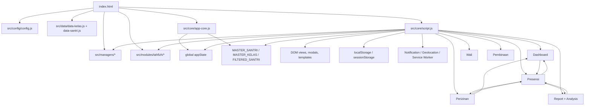
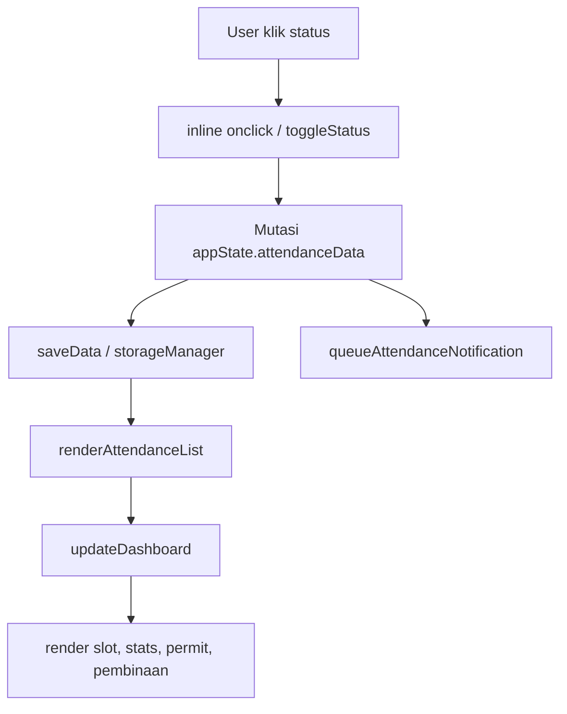

# Audit Arsitektur `src/core/script.js`

Tanggal audit: 2026-06-26  
Status: Audit dan rencana refactor, belum melakukan perubahan kode aplikasi.

## 1. Ringkasan Kondisi

`src/core/script.js` masih berfungsi sebagai monolith utama aplikasi. File ini tidak hanya menjalankan bootstrap aplikasi, tetapi juga menangani autentikasi, role wali/musyrif/admin, dashboard, presensi, laporan, analisis, perizinan, pembinaan, GPS, notifikasi, modal, onboarding, storage, PWA-related behavior, dan rendering DOM.

File ini memakai pola global namespace melalui `window.*`. Banyak fungsi saling memanggil secara langsung, membaca dan menulis `appState`, lalu memicu render ulang dari banyak tempat. Kondisi ini membuat perubahan kecil berisiko memengaruhi domain lain.

Catatan penting: permintaan menyebut Supabase dan realtime, tetapi hasil audit terhadap `script.js` menunjukkan tidak ada referensi Supabase. Arsitektur aktif pada file ini lebih dominan `localStorage`, Google Sheet loader, Notification API, Geolocation API, service worker/PWA, dan manager lokal.

`design.md` tidak ditemukan di workspace saat audit. Konteks aplikasi dibaca dari `README.md`, `index.html`, `REFACTOR-REPORT.md`, `src/core/app-core.js`, `src/config/config.js`, manager files, PWA files, templates, dan struktur folder `src/`.

## 2. Statistik Ukuran dan Kompleksitas

| Metrik | Nilai |
| --- | ---: |
| Ukuran file | 507,554 karakter |
| Jumlah baris | 12,568 |
| Fungsi terdeteksi | 283 |
| Assignment/export `window.*` | 286 |
| `document.getElementById` | 438 |
| `querySelector/querySelectorAll` | 73 |
| `addEventListener` | 10 |
| `removeEventListener` | 4 |
| `localStorage` access | 40 |
| `fetch` | 1 |
| `async` | 17 |
| `await` | 17 |
| `setTimeout` | 40 |
| `setInterval` | 3 |
| Referensi Supabase | 0 |

Kesimpulan statistik: kompleksitas terbesar bukan hanya panjang file, tetapi jumlah global export, direct DOM access, dan direct state mutation yang tersebar.

## 3. Peta Domain

| Domain | Fungsi representatif | Tanggung jawab |
| --- | --- | --- |
| Bootstrap | `initApp`, `startClock`, `initConnectionIndicator` | Inisialisasi UI, data, storage, session, clock, koneksi |
| Autentikasi | `handleMusyrifSubmit`, `handleWaliSubmit`, `handleGoogleCallback`, `startAuthenticatedSession` | Login musyrif, wali, admin, testing, Google auth |
| Role | `syncRoleModeUI`, `isWaliMode`, `getWaliDisplayName` | Mode wali/admin/musyrif dan tampilan role |
| Dashboard | `updateDashboard`, `renderSlotList`, `renderWeeklyCalendar`, `updateQuickStats` | Tampilan utama, slot, ringkasan, quick action |
| Presensi | `openAttendance`, `renderAttendanceList`, `toggleStatus`, `applyBulkAction` | Buka sesi, render santri, status, bulk action, autosave |
| Laporan | `updateReportTab`, `setReportMode`, `getReportDateRange` | Report daily/weekly/monthly/semester |
| Analisis | `runAnalysis`, `renderAnalysisTimeline`, `renderAnalysisTrendChart` | Analisis santri, tren, timeline, scoring |
| Perizinan | `openPermitModal`, `savePermitLogic`, `renderPermitList`, `renderPermitHistory` | Sakit, izin, pulang, riwayat, status aktif |
| Pembinaan | `collectPembinaanViolations`, `renderDashboardPembinaan`, `renderPembinaanManagement` | Pelanggaran, level pembinaan, modal pembinaan |
| GPS | `verifyLocation`, `requestGPSPermissionOnStartup`, `updateLocationStatus` | Geofencing, cache lokasi, izin browser |
| Notifikasi | `toggleNotifications`, `sendLocalNotification`, `checkScheduledNotifications` | Permission, local notification, scheduled reminder |
| Modal/UI shell | `openModal`, `closeModal`, `switchTab`, `showToast` | Modal stack, tab navigation, feedback UI |
| Onboarding | `showOnboarding`, `setOnboardingSlide`, `startOnboardingAutoplay` | Slider onboarding dan first-run behavior |
| Utility | `sanitizeHTML`, `getGrade`, `getPredikat`, `getDistanceFromLatLonInMeters` | Helper lintas domain |

## 4. Dependency Graph



Dependency utama masih berupa runtime global dependency, bukan ES module import. Ini membuat circular dependency sulit terlihat secara statis, tetapi sangat terasa pada runtime flow.

## 5. Daftar God Function

| Fungsi | Lokasi | Panjang | Alasan |
| --- | ---: | ---: | --- |
| `updateReportTab` | line 5919 | 1,140 baris | Menggabungkan period calculation, mode report, scoring, aggregation, HTML table/cards, role wali, dan DOM render |
| `renderAttendanceList` | line 3746 | 588 baris | Menggabungkan filtering santri, izin aktif, holiday rules, status derivation, rendering row, inline events, review gate, save, dan dashboard refresh |
| `runAnalysis` | line 8175 | 400 baris | Menggabungkan data mining attendance, scoring, rekomendasi, chart, timeline, dan DOM |
| `updateLocationStatus` | line 2412 | 334 baris | Menggabungkan GPS permission, cache, fallback, status card, dan UI state |
| `updateDashboard` | line 2053 | 307 baris | Orkestrasi banyak widget, slot, tanggal, akses, role, permit, pembinaan, dan render |
| `drawDonutChart` | line 5482 | 250 baris | Chart drawing, data extraction, styling, dan rendering canvas bercampur |
| `renderPermitHistory` | line 11015 | 232 baris | Menggabungkan histori permit, status manual dari presensi, render action, dan formatting |
| `initApp` | line 7 | 215 baris | Bootstrap data, auth restore, role setup, storage, UI transition, onboarding |
| `renderSlotList` | line 2994 | 212 baris | Slot access, stats, holiday handling, dashboard button rendering |
| `initSalatHijriWidget` | line 11827 | 209 baris | Fetch jadwal, location, hijri/salat widget, cache/fallback, countdown |

## 6. Daftar God Module

### `src/core/script.js`

Alasan:

- Menangani hampir semua domain aplikasi.
- Menjadi pusat global function registry melalui `window.*`.
- Dipanggil langsung dari inline handler di HTML string.
- Membaca dan menulis `appState` dari banyak lokasi.
- Mengakses DOM, browser API, storage, dan business logic sekaligus.
- Sulit diuji tanpa browser penuh dan data global lengkap.

### `appState`

Alasan:

- Menyimpan state lintas domain: auth, role, tanggal, attendance, permits, report, analysis, settings, wali, admin.
- Ditulis langsung oleh banyak fungsi.
- Ada `StateStore` dan `mutateState`, tetapi belum menjadi jalur tunggal mutasi.

## 7. Daftar Global State

Global state utama:

- `appState`
- `MASTER_SANTRI`
- `MASTER_KELAS`
- `FILTERED_SANTRI`
- `STUDENT_INDEX`
- `ATTENDANCE_INDEX`
- `currentPermitTab`
- `currentModalMode`
- `isAllSelected`
- `waliConfirmedStudent`
- `loginIconClickCount`
- `loginIconClickTimeout`
- `muinClickCount`
- `muinClickTimeout`
- `superadminBtnVisible`
- `locationCardClickCount`
- `locationCardClickTimeout`
- `window.googleBypassActive`
- `window.gpsBypassEnabled`
- `window.gpsTestMode`
- `window.asramaNavigationTestEnabled`
- `window.attendanceNotificationTimeouts`
- `window._gpsLocationCache`
- `modalStack`
- `clockInterval`
- `saveTimeout`
- `lucideTimeout`
- onboarding state: `onboardingCurrentSlide`, `onboardingAutoplayTimer`, touch coordinates, auto-open flag

Risiko:

- Mutasi tidak terpusat.
- Race condition autosave dan render.
- UI bisa membaca state setengah berubah.
- Sulit membuat test deterministik.
- Banyak state sementara tidak memiliki lifecycle cleanup eksplisit.

## 8. Daftar Event Listener

| Event | Lokasi/Fungsi | Catatan |
| --- | --- | --- |
| `scroll` | `initBottomNavScroll` | Handler disimpan dan dilepas, relatif lebih aman |
| `scroll` | `renderAttendanceReviewGate` | Handler ditempel ke container dan dibersihkan manual |
| `keydown` | `openModal` | ESC dan focus trap memakai handler tersimpan |
| `online` | `initConnectionIndicator` | Anonymous listener, tidak ada cleanup |
| `offline` | `initConnectionIndicator` | Anonymous listener, tidak ada cleanup |
| `click` | `setupTimesheetSecretTrigger` | Anonymous listener |
| `visibilitychange` | global listener | Memanggil scheduled notifications |
| `focus` | global listener | Memanggil scheduled notifications |
| `touchstart` | onboarding slider | Anonymous listener |
| `touchend` | onboarding slider | Anonymous listener |

Masalah utama:

- Banyak interaksi UI memakai inline `onclick`/`onchange` dalam HTML string, bukan `addEventListener`.
- Lifecycle listener belum punya registry terpusat.
- Risiko duplicate listener jika fungsi init dipanggil ulang.

## 9. Audit DOM

Temuan:

- `document.getElementById` muncul 438 kali.
- `querySelector/querySelectorAll` muncul 73 kali.
- Banyak renderer membangun HTML string langsung.
- Rendering, business logic, dan state mutation bercampur.
- ID DOM menjadi hidden contract antar fungsi.
- Inline event handler membuat dependency global `window.*` makin kuat.

Peluang pemisahan:

- Buat `dom-registry.js` untuk selector penting.
- Buat renderer per domain yang hanya menerima data siap render.
- Buat controller per domain untuk event handling.
- Ganti inline handler bertahap dengan event delegation.

## 10. Audit Data Flow

Data flow presensi saat ini:



Titik campur tanggung jawab:

- `toggleStatus` melakukan mutation, save, render, dashboard update, dan notifikasi.
- `renderAttendanceList` menghitung status domain sekaligus membangun DOM.
- `savePermitLogic` mengubah data permit lalu memicu banyak surface render.
- `updateDashboard` menjadi aggregator lintas domain.

## 11. Audit Domain Mixing

Fungsi yang mencampur domain:

- `updateDashboard`: dashboard + attendance + permit + pembinaan + role + date.
- `renderAttendanceList`: attendance + permit + notification + DOM + holiday rules.
- `toggleStatus`: attendance + save + notification + dashboard.
- `updateReportTab`: report + attendance + wali + scoring + DOM.
- `runAnalysis`: analysis + attendance + report period + DOM.
- `savePermitLogic`: permit + wali + attendance surface + dashboard.
- `renderPermitHistory`: permit + attendance manual status + profile UI.
- `initApp`: bootstrap + auth + data + role + UI.

Domain yang perlu dipisahkan secara eksplisit:

- Presensi
- Tahfizh
- Pembinaan
- Perizinan
- Notifikasi
- Dashboard
- Profil
- Pengaturan
- Wali
- Admin
- GPS/PWA platform

## 12. Audit Utilities

Utility generik yang layak dipindah:

- HTML escaping/sanitizing
- Date formatting dan range
- Grade/predikat
- Status metadata
- Distance calculation
- Safe JSON parse
- Toast/icon helper

Utility yang sebenarnya domain-specific:

- `evaluatePermitForSlot`
- `getPermitRuntimeState`
- `calculateReportScoreForStudentRange`
- `getDailyReportStatusMeta`
- `getWaliAttendanceSummary`
- `collectPembinaanViolations`
- `getIncompleteAttendanceCountForDate`

Rekomendasi: jangan masukkan semua ke folder `utils`. Pisahkan antara `shared/utils` dan domain service agar logic domain tetap punya pemilik.

## 13. Audit Async Flow

Async utama:

- `initApp`
- `startAuthenticatedSession`
- `handleMusyrifSubmit`
- `handleWaliSubmit`
- `handleGoogleCallback`
- `saveData`
- `toggleNotifications`
- `requestGPSPermissionOnStartup`
- `verifyLocationCached`
- `initSalatHijriWidget`
- `refreshPrayerLocation`

Risiko:

- `initApp` menjalankan data loading, auth restore, role setup, dan UI transition dalam satu fungsi panjang.
- `saveData` bisa dipanggil dari banyak tempat setelah state berubah langsung.
- GPS flow memakai callback browser API dan local/session storage.
- Notification scheduling dipanggil dari clock, focus, visibility.
- Tidak ada request cancellation atau lifecycle guard yang jelas untuk beberapa async UI update.

## 14. Technical Debt

Temuan:

- Duplikasi fungsi `renderWaliView`.
- Duplikasi fungsi `showWaliView`.
- Banyak komentar patch history seperti `BARU`, `UPDATED`, `TAMBAHKAN INI`, `CRITICAL FIX`.
- Direct mutation ke `appState` masih dominan meskipun ada `StateStore`/`mutateState`.
- Inline event handlers membuat refactor sulit.
- Banyak global function diekspos tanpa boundary.
- Tidak ada automated tests.
- `package.json` masih berisi `"test": "echo \"Error: no test specified\" && exit 1"`.
- Existing manager files sudah ada, tetapi belum benar-benar menggantikan logic monolith.

## 15. Hidden Dependency

- Urutan script di `index.html` wajib benar.
- `script.js` bergantung pada global dari `config.js`, data loaders, `app-core.js`, manager files, Lucide, Chart.js, jsPDF.
- Banyak fungsi mengasumsikan ID DOM tertentu selalu tersedia.
- Role behavior bergantung pada kombinasi `appState.waliMode`, `appState.adminMode`, `appState.selectedClass`, dan `userProfile.authProvider`.
- Storage key tersebar lewat `APP_CONFIG`, `APP_CONSTANTS`, dan hardcoded key lain.
- Notification dan GPS bergantung pada permission browser dan cache.

## 16. Tight Coupling

| Area | Coupling |
| --- | --- |
| Presensi | Terikat ke permit, dashboard, notification, storage, DOM |
| Report | Terikat ke attendance schema, slot config, holiday rules, DOM |
| Permit | Terikat ke attendance status, dashboard surfaces, profile history |
| Dashboard | Terikat ke hampir semua domain |
| Modal | Terikat ke DOM ID, focus trap, class transition |
| Auth | Terikat ke storage, data loader, role UI, dashboard init |
| GPS | Terikat ke dashboard card, notification, storage, browser API |

## 17. Circular Dependency

Tidak ada circular import karena arsitektur belum memakai ES modules untuk `script.js`. Namun ada circular runtime flow:

- `toggleStatus` -> `saveData` -> `renderAttendanceList` -> user event -> `toggleStatus`
- `toggleStatus` -> `updateDashboard` -> quick access/open attendance -> attendance flow
- `savePermitLogic` -> `refreshPermitSurfaces` -> `renderAttendanceList` + `updateDashboard` + `renderPermitHistory`
- `startClock` -> `updateDashboard` -> slot/current date update -> clock tick berikutnya
- `switchTab` -> domain renderer -> renderer memicu modal/navigation/dashboard refresh

## 18. Peluang Modularisasi

| Bagian | Target | Alasan |
| --- | --- | --- |
| Bootstrap kecil | `app-bootstrap.js` | Menjaga entry point sederhana |
| Global compatibility | `legacy-bridge.js` | Menjaga inline handler lama tetap hidup sementara |
| State | `app-store.js` | Mutasi terpusat dan selector jelas |
| Date/status/grade | `shared/utils` | Pure function, risiko rendah |
| Storage | `platform/storage.service.js` | Isolasi key dan persistence |
| Notification | `platform/notification.service.js` | Browser API dan scheduling terisolasi |
| GPS | `platform/geolocation.service.js` | Permission/cache/distance terpisah |
| Attendance | `domains/attendance/*` | Domain paling kritikal, perlu service + renderer + controller |
| Permit | `domains/permits/*` | Perizinan punya lifecycle dan efek ke attendance |
| Report/analysis | `domains/reports/*` | Calculation harus dipisah dari DOM |
| Dashboard | `domains/dashboard/*` | Orkestrator UI, bukan pemilik semua logic |
| Wali | `domains/wali/*` | Role-specific rendering dan logic |
| Modal/toast | `dom/*` | Infrastruktur UI bersama |

## 19. Struktur Modul Rekomendasi

```text
src/core/
  app-bootstrap.js
  app-store.js
  legacy-bridge.js
  dom-registry.js

src/shared/
  date-utils.js
  status-utils.js
  html-utils.js
  scoring-utils.js

src/platform/
  storage.service.js
  notification.service.js
  geolocation.service.js
  pwa.service.js

src/dom/
  modal-controller.js
  toast.js
  event-delegation.js

src/domains/attendance/
  attendance.selectors.js
  attendance.service.js
  attendance.renderer.js
  attendance.controller.js

src/domains/permits/
  permit.selectors.js
  permit.service.js
  permit.renderer.js
  permit.controller.js

src/domains/reports/
  report.service.js
  report.renderer.js
  analysis.service.js
  analysis.renderer.js

src/domains/dashboard/
  dashboard.selectors.js
  dashboard.renderer.js
  dashboard.controller.js

src/domains/wali/
  wali.service.js
  wali.renderer.js
  wali.controller.js

src/domains/pembinaan/
  pembinaan.service.js
  pembinaan.renderer.js
```

## 20. Prioritas Refactor Bertahap

### Tahap 0 - Safety Baseline

Tujuan:

- Dokumentasikan public API `window.*`.
- Buat smoke checklist manual.
- Ambil snapshot output penting jika memungkinkan.

Risiko: rendah.

Validasi:

- Aplikasi load tanpa console error.
- Login musyrif, wali, admin berjalan.
- Dashboard tampil.
- Presensi dapat dibuka.

### Tahap 1 - Ekstrak Pure Utilities

Target:

- Date utility.
- Grade/predikat.
- Status metadata.
- HTML/sanitize helper.
- GPS distance math.

Risiko: rendah.

Validasi:

- Output formatting tanggal sama.
- Grade dan predikat sama.
- Status pill/report sama.
- Tidak ada perubahan UI.

### Tahap 2 - State Selectors

Target:

- Buat selector read-only untuk `appState`.
- Jangan ubah mutasi dulu.

Risiko: rendah-sedang.

Validasi:

- Dashboard, report, attendance membaca data sama.
- Tidak ada perubahan storage.

### Tahap 3 - Storage Wrapper

Target:

- Satukan akses `localStorage`/`sessionStorage`.
- Pertahankan key lama.

Risiko: sedang.

Validasi:

- Auto-login tetap jalan.
- Data presensi lama terbaca.
- Permit lama terbaca.
- Settings dark mode/notifikasi tetap terbaca.

### Tahap 4 - Renderer Extraction

Target:

- Pisahkan renderer yang tidak melakukan mutasi state.
- Mulai dari component kecil: toast, modal, slot item, permit history row.

Risiko: sedang.

Validasi:

- HTML visual tidak berubah.
- Modal open/close tetap jalan.
- Icon Lucide tetap refresh.

### Tahap 5 - Permit Service

Target:

- Pindahkan logic permit aktif, runtime state, persist permit.
- Controller lama tetap memanggil adapter.

Risiko: sedang.

Validasi:

- Izin sakit, izin, pulang tetap berdampak sama.
- Riwayat permit sama.
- Delete/edit/extend/recovered/returned tetap jalan.

### Tahap 6 - Attendance Service

Target:

- Pindahkan mutation status, bulk action, slot status calculation.
- Jangan ubah schema `attendanceData`.

Risiko: tinggi.

Validasi:

- Toggle status satu santri.
- Bulk action.
- Review gate.
- Autosave.
- Dashboard stats.
- Report.
- Notification setelah status buruk.

### Tahap 7 - Report and Analysis Service

Target:

- Pisahkan calculation dari rendering.
- `updateReportTab` diperkecil menjadi orchestration + renderer.

Risiko: tinggi.

Validasi:

- Report daily/weekly/monthly/semester sama.
- Wali report tetap jalan.
- Analysis timeline dan chart sama.

### Tahap 8 - Event Delegation

Target:

- Kurangi inline handler.
- Buat delegated events per domain.

Risiko: sedang-tinggi.

Validasi:

- Semua tombol lama tetap aktif.
- Tidak ada double event.
- Listener tidak bertambah setelah tab switch.

### Tahap 9 - Kecilkan `script.js`

Target:

- `script.js` menjadi compatibility layer sementara.
- Bootstrap pindah ke file kecil.

Risiko: tinggi.

Validasi:

- Full smoke test semua role.
- PWA/offline.
- GPS/notification.
- Report/export.
- Tahfizh integration.

## 21. Checklist Validasi Global

Gunakan checklist ini setelah setiap tahap:

- Aplikasi load tanpa error console.
- Onboarding muncul sesuai kondisi first-run.
- Login musyrif berhasil.
- Login wali berhasil.
- Login admin berhasil.
- Auto-login dari session lama berhasil.
- Logout membersihkan session sesuai perilaku lama.
- Dashboard tampil untuk tanggal hari ini.
- Dashboard tampil untuk tanggal lampau.
- Quick access slot sesuai akses waktu.
- Presensi bisa dibuka.
- Status santri bisa diubah.
- Bulk action berjalan.
- Data tersimpan setelah refresh.
- Izin sakit/izin/pulang mempengaruhi presensi.
- Permit history tampil.
- Pembinaan muncul dari data pelanggaran.
- Report daily berjalan.
- Report weekly berjalan.
- Report monthly berjalan.
- Report semester berjalan.
- Analysis santri berjalan.
- Profile/timesheet berjalan.
- GPS permission dan cache berjalan.
- Notification permission dan reminder tidak double.
- PWA service worker tidak error.
- Tahfizh tab tetap berjalan.

## 22. Kesimpulan

`script.js` sebaiknya tidak langsung dipecah berdasarkan blok baris. Risiko terbesar berasal dari global state, DOM inline handlers, dan flow lintas domain yang saling memicu render.

Strategi refactor paling aman adalah:

1. Petakan dan lindungi behavior lama.
2. Ekstrak pure utilities.
3. Tambahkan selector/store tanpa mengubah perilaku.
4. Pisahkan renderer dari business logic.
5. Baru pindahkan service domain berisiko tinggi seperti presensi, permit, report, dan analysis.
6. Pertahankan `window.*` compatibility bridge sampai semua inline handler diganti.

Dengan pendekatan ini, file monolith bisa dikurangi bertahap tanpa mengubah UI, UX, business logic, API, atau data lama.
